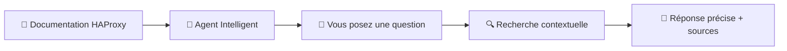
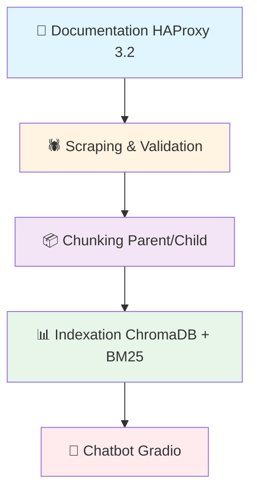
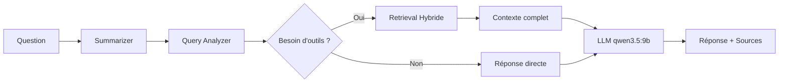

# 🤖 HAProxy RAG Agentic

> **Assistant intelligent pour la documentation HAProxy 3.2**  
> Propulsé par **LangGraph** et **Ollama** — 100% local, production-ready

[](https://github.com)
[](https://github.com)
[](https://github.com)
[](https://github.com)
[](https://github.com)

---

## ✨ Qu'est-ce que le RAG Agentic ?

Le **RAG Agentic** est un système intelligent de questions-réponses qui comprend et explique la documentation HAProxy 3.2 en langage naturel.

### 🎯 Comment ça marche ?



Contrairement à un chatbot classique, notre agent **raisonne** avant de répondre :

1. **Il analyse** votre question et la reformule pour mieux la comprendre
2. **Il recherche** dans la documentation les passages pertinents
3. **Il vérifie** qu'il a suffisamment de contexte
4. **Il répond** avec précision en citant ses sources

### 🚀 Pourquoi "Agentic" ?

Parce qu'il utilise une **architecture multi-agents** avec LangGraph :

- 🧠 **Summarizer** : Garde le contexte de votre conversation
- ✍️ **Query Analyzer** : Reformule vos questions pour plus de précision
- 🔎 **Retriever** : Trouve les informations pertinentes (Vector + BM25)
- 📚 **Context Manager** : Gère les documents sources complets
- ✅ **Validator** : Peut valider vos configurations HAProxy

---

## 📊 Performances

| Benchmark | Questions | Qualité | Réussite | Temps moyen |
|-----------|-----------|---------|----------|-------------|
| **FULL** | 92 | **0.914/1.0** 🏆 | **92.4%** 🏆 | 34.6s |

**Comparaison avec un RAG standard :**

| Système | Qualité | Réussite |
|---------|---------|----------|
| RAG Standard | 0.868/1.0 | 88% |
| **RAG Agentic** | **0.914/1.0** (+5.3%) | **92.4%** (+4.4%) |

---

## ⚡ Démarrage Rapide

### 1️⃣ Installer les prérequis

```bash
# Python 3.11+ requis
python --version

# Installer uv (gestionnaire de paquets)
pip install uv

# Installer Ollama (LLM local)
# Linux/macOS:
curl -fsSL https://ollama.com/install.sh | sh

# Windows: Télécharger depuis https://ollama.com/download
```

### 2️⃣ Installer les modèles IA

```bash
# Modèle d'embedding (recherche sémantique)
ollama pull qwen3-embedding:8b

# Modèle principal (génération de réponses)
ollama pull qwen3.5:9b
```

### 3️⃣ Installer le projet

```bash
# Cloner et installer les dépendances
git clone https://github.com/laurentvv/haproxy-dataset-generator.git
cd haproxy-dataset-generator
uv sync
```

### 4️⃣ Construire la base de connaissances

```bash
# Reconstruire tout le pipeline (~1h10)
cd agentic_rag
uv run python 00_rebuild_agentic.py
```

> ⏱️ **Temps estimé** : ~1h10 pour le premier build (scraping + chunking + indexation)

### 5️⃣ Lancer le chatbot

```bash
uv run python 04_agentic_chatbot.py
```

🎉 **Accédez au chatbot** : [http://localhost:7861](http://localhost:7861)

---

## 💬 Interface de Chat

### Fonctionnalités

- 💬 **Conversation fluide** : Historique complet de vos échanges
- ⚡ **Streaming** : Réponses affichées en temps réel
- 📚 **Sources citées** : Chaque réponse référence la documentation originale
- 🔄 **Multi-tours** : L'agent se souvient du contexte de la conversation
- 💾 **Export/Import** : Sauvegardez vos conversations en JSON

### Exemples de questions

```
❓ "Comment configurer un backend HTTP dans HAProxy 3.2 ?"
❓ "Quelles sont les nouveautés de HAProxy 3.2 ?"
❓ "Comment utiliser les stick-tables pour la persistance ?"
❓ "Peux-tu m'expliquer le load balancing round-robin ?"
❓ "C'est quoi le multiplexer dans HAProxy ?"
```

---

## 🏗️ Architecture du Système

### Pipeline de traitement



### Phase 1 : Scraping & Validation

**Objectif** : Extraire la documentation officielle depuis docs.haproxy.org

- 🕷️ **168 sections** scrapées et validées
- 📋 Metadata enrichie (titres, hiérarchie, sections)
- ✅ Validation de structure automatique
- 💾 Stockage : `data_agentic/scraped_pages/scraped_3.2.json`

⏱️ **Durée** : ~5 minutes

### Phase 2 : Chunking Parent/Child

**Objectif** : Diviser intelligemment la documentation pour une recherche optimale

**Stratégie hiérarchique** :
- 📄 **Parents** : Documents complets (4000 chars) pour le contexte
- 📝 **Children** : Chunks précis (300 chars) pour la recherche
- 🔄 **Overlap 50%** : 150 chars de recouvrement pour préserver le sens

**Résultat** : 101 parents → 915 children

⏱️ **Durée** : ~5 minutes

### Phase 3 : Indexation Hybride

**Objectif** : Indexer pour une recherche ultra-performante

**Double indexation** :
1. 🧮 **Vector Search (ChromaDB)** : Compréhension sémantique
2. 🔤 **BM25 Search** : Mots-clés exacts
3. 🎯 **Fusion RRF** : Combine les deux pour +14% de qualité

⏱️ **Durée** : ~1 minute

### Phase 4 : Agent LangGraph

**Objectif** : Orchestration intelligente du raisonnement



---

## ⚙️ Configuration

### Variables d'environnement

```bash
# URL du serveur Ollama
export OLLAMA_URL=http://localhost:11434

# Modèles IA
export EMBED_MODEL=qwen3-embedding:8b
export LLM_MODEL=qwen3.5:9b

# Paramètres RAG
export CHILD_CHUNK_SIZE=300
export DEFAULT_K_CHILD=5
export HYBRID_RETRIEVAL_ENABLED=true
```

### Fichier de configuration

Tous les paramètres sont dans [`agentic_rag/config_agentic.py`](agentic_rag/config_agentic.py) :

```python
SCRAPER_CONFIG = { ... }      # Configuration du scraping
CHUNKING_CONFIG = { ... }     # Configuration du chunking
CHROMA_CONFIG = { ... }       # Configuration ChromaDB
LANGGRAPH_CONFIG = { ... }    # Configuration LangGraph
LLM_CONFIG = { ... }          # Configuration des LLM
GRADIO_CONFIG = { ... }       # Configuration Gradio
```

---

## 🔧 Dépannage

### Ollama ne répond pas

```bash
# Vérifier si Ollama tourne
ollama ps

# Redémarrer le service
ollama serve
```

### Modèles manquants

```bash
# Réinstaller les modèles
ollama pull qwen3-embedding:8b
ollama pull qwen3.5:9b
```

### Reconstruire l'index

```bash
# Supprimer l'index existant
rm -rf index_agentic/chroma_db/*

# Réindexer
cd agentic_rag
uv run python 03_indexing_chroma.py
```

### Réponses trop lentes

```bash
# Utiliser un modèle plus rapide
export LLM_MODEL=qwen3:latest

# Réduire le nombre de chunks recherchés
export DEFAULT_K_CHILD=5
```

---

## 📁 Structure du Projet

```
haproxy-dataset-generator/
├── agentic_rag/              # ⭐ Système RAG Agentic (PRINCIPAL)
│   ├── 00_rebuild_agentic.py         # 🔄 Reconstruction complète
│   ├── 01_scrape_verified.py         # 🕷️ Scraping & Validation
│   ├── 02_chunking_parent_child.py   # 📦 Chunking hiérarchique
│   ├── 03_indexing_chroma.py         # 📊 Indexation hybride
│   ├── 04_agentic_chatbot.py         # 💬 Chatbot Gradio
│   ├── 05_bench_agentic.py           # 📈 Benchmark
│   ├── config_agentic.py             # ⚙️ Configuration
│   ├── rag_agent/                    # 🧠 Agent LangGraph
│   ├── app/                          # 🎨 Interface Gradio
│   └── README_AGENTIC.md             # 📖 Documentation détaillée
│
├── rag/                      # 📦 RAG Standard (ARCHIVE)
│   └── ...                   # (Ancienne version, conservée pour référence)
│
├── doc/                      # 📚 Documentation Technique
│   ├── GUIDE_COMPLET.md
│   ├── GUIDE_IMPLEMENTATION_AGENTIC.md
│   └── plans/                # Plans d'architecture
│
└── pyproject.toml            # 📋 Dépendances
```

---

## 📖 Documentation Complète

### Pour commencer

- 📘 **[Guide d'implémentation](doc/GUIDE_IMPLEMENTATION_AGENTIC.md)** — Comprendre l'architecture
- 📗 **[Documentation Agentic](agentic_rag/README_AGENTIC.md)** — Détails du système
- 📙 **[Plan d'architecture](doc/plans/PLAN_AGENTIC_RAG_HAPROXY.md)** — Vue d'ensemble technique

### Pour aller plus loin

- 📊 **[Suivi des performances](agentic_rag/PERFORMANCE.md)** — Métriques et benchmarks
- 🧠 **[Apprentissages](doc/LEARNING.md)** — Découvertes et bonnes pratiques
- 📋 **[Instructions agents](doc/AGENTS.md)** — Guide pour les contributeurs

---

## 🚀 Déploiement Production

### Prérequis système

| Ressource | Minimum | Recommandé |
|-----------|---------|------------|
| **RAM** | 16 GB | 32 GB |
| **Stockage** | 10 GB | 20 GB |
| **GPU** | Optionnel | NVIDIA 8+ GB VRAM |
| **CPU** | 4 cœurs | 8 cœurs |

### Checklist de déploiement

```bash
# 1. Vérifier les prérequis
ollama --version
python --version  # 3.11+

# 2. Installer les modèles
ollama pull qwen3-embedding:8b
ollama pull qwen3.5:9b

# 3. Build initial (~1h10)
cd agentic_rag
uv run python 00_rebuild_agentic.py

# 4. Validation (benchmark quick ~4 min)
uv run python 05_bench_agentic.py --level quick

# 5. Démarrage chatbot
uv run python 04_agentic_chatbot.py
```

### Monitoring

```bash
# Vérifier les modèles chargés
ollama ps

# Vérifier l'index ChromaDB
ls -la index_agentic/chroma_db/

# Logs en temps réel (si activés)
tail -f logs/*.log
```

---

## 🧪 Tests & Benchmarks

### Lancer les tests

```bash
cd agentic_rag
uv run pytest
```

### Benchmark rapide (~4 min)

```bash
uv run python 05_bench_agentic.py --level quick
```

### Benchmark complet (~35 min)

```bash
uv run python 05_bench_agentic.py --level full
```

---

## 🎯 Améliorations Futures

| Fonctionnalité | Gain estimé | Effort | Statut |
|----------------|-------------|--------|--------|
| Enrichissement IA metadata | +2-3% qualité | ~2h | 📋 Backlog |
| Query expansion LLM | +1-2% qualité | ~1h | 📋 Backlog |
| FlashRank reranking | +1-2% qualité | ~1h | 📋 Backlog |

**Cible finale** : 0.95+/1.0 qualité, 95%+ réussite

---

## 🤝 Contribuer

1. Fork le projet
2. Créez une branche (`git checkout -b feature/amelioration`)
3. Committez vos changements (`git commit -m 'feat: ajout fonctionnalité'`)
4. Pushez (`git push origin feature/amelioration`)
5. Ouvrez une Pull Request

---

## 📄 License

Projet open-source pour la documentation HAProxy.

---

## 🙏 Remerciements

- **[HAProxy](https://www.haproxy.org/)** — Pour leur excellente documentation
- **[LangGraph](https://langchain-ai.github.io/langgraph/)** — Pour l'architecture agentic
- **[Ollama](https://ollama.com/)** — Pour les LLM locaux performants
- **[ChromaDB](https://www.trychroma.com/)** — Pour la base vectorielle

---

**Dernière mise à jour** : 2026-03-04  
**Statut** : ✅ **PRÊT POUR PRODUCTION**

---

<p align="center">
  <strong>Prêt à discuter HAProxy ?</strong><br>
  <code>cd agentic_rag && uv run python 04_agentic_chatbot.py</code>
</p>
