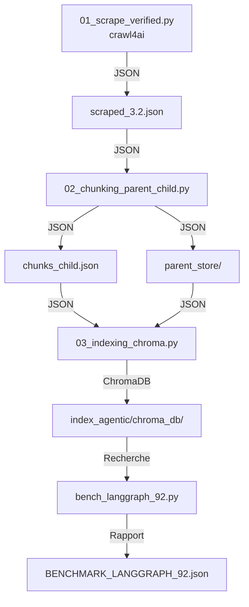

# Plan d'intégration du script de scraping crawl4ai dans agentic_rag

## Objectif
Intégrer le nouveau script de scraping basé sur crawl4ai ([`01_scrape.py`](01_scrape.py)) dans le répertoire [`agentic_rag/`](agentic_rag/) en remplacement de [`agentic_rag/01_scrape_verified.py`](agentic_rag/01_scrape_verified.py), en maintenant la compatibilité avec le système existant.

---

## Analyse comparative des approches

### Script actuel : [`agentic_rag/01_scrape_verified.py`](agentic_rag/01_scrape_verified.py)

**Caractéristiques :**
- Utilise BeautifulSoup pour le scraping
- Extrait la hiérarchie parent/child
- Génère `scraped_3.2.json` (format JSON, tableau d'objets)
- Inclut des métadonnées détaillées : `url`, `title`, `content`, `parent_url`, `parent_title`, `depth`, `section_path`, `anchor`, `source_file`
- Utilise des modules complexes : [`HAProxyScraper`](agentic_rag/scraper/haproxy_scraper.py), [`HTMLStructureAnalyzer`](agentic_rag/scraper/html_structure_analyzer.py), [`ReferenceComparator`](agentic_rag/scraper/compare_with_reference.py)
- Inclut des validations et rapports détaillés
- Sauvegarde dans `agentic_rag/data_agentic/scraped_pages/scraped_3.2.json`

**Format de sortie :**
```json
[
  {
    "url": "https://docs.haproxy.org/3.2/configuration.html",
    "title": "Configuration",
    "content": "...",
    "parent_url": "...",
    "parent_title": "...",
    "depth": 1,
    "section_path": ["Configuration"],
    "anchor": "config",
    "source_file": "..."
  }
]
```

### Nouveau script : [`01_scrape.py`](01_scrape.py)

**Caractéristiques :**
- Utilise crawl4ai (AsyncWebCrawler)
- Génère `sections.jsonl` (format JSONL, une ligne par section)
- Inclut des métadonnées simples : `title`, `content`, `url`
- Parse le markdown généré par crawl4ai pour extraire les sections
- Sauvegarde dans `data/sections.jsonl`

**Format de sortie :**
```jsonl
{"title": "3.4.1. Configuration", "content": "...", "url": "https://docs.haproxy.org/3.2/configuration.html#3.4.1"}
```

---

## Différences clés

| Aspect | Ancien (BeautifulSoup) | Nouveau (crawl4ai) |
|--------|----------------------|-------------------|
| **Format de sortie** | JSON (tableau) | JSONL (une ligne par section) |
| **Métadonnées** | Riches (depth, section_path, anchor, etc.) | Simples (title, content, url) |
| **Hiérarchie** | Extraite explicitement | Implicite dans les titres |
| **Complexité** | Élevée (plusieurs modules) | Faible (script unique) |
| **Validation** | Rapports détaillés | Aucune validation |
| **Emplacement** | `agentic_rag/data_agentic/scraped_pages/` | `data/` |

---

## Plan d'intégration

### Étape 1 : Adapter le nouveau script pour agentic_rag

**Objectif :** Créer [`agentic_rag/01_scrape_crawl4ai.py`](agentic_rag/01_scrape_crawl4ai.py) qui :
1. Utilise crawl4ai pour le scraping
2. Génère le format JSON attendu par le système (pas JSONL)
3. Ajoute les métadonnées nécessaires pour le chunking parent/child
4. Sauvegarde dans `agentic_rag/data_agentic/scraped_pages/scraped_3.2.json`

**Adaptations nécessaires :**
1. **Format de sortie :** Convertir JSONL en JSON (tableau d'objets)
2. **Métadonnées :** Ajouter les champs manquants :
   - `parent_url` : URL de la page parente
   - `parent_title` : Titre de la page parente
   - `depth` : Profondeur dans la hiérarchie (calculée à partir du titre)
   - `section_path` : Chemin de section (basé sur la hiérarchie des titres)
   - `anchor` : ID de l'ancre (extrait de l'URL)
   - `source_file` : Fichier source (optionnel)
3. **Emplacement :** Sauvegarder dans `agentic_rag/data_agentic/scraped_pages/scraped_3.2.json`
4. **Validation :** Ajouter un rapport de validation basique

### Étape 2 : Remplacer l'ancien script

**Actions :**
1. Sauvegarder l'ancien script : `agentic_rag/01_scrape_verified.py` → `agentic_rag/01_scrape_verified.py.backup`
2. Copier le nouveau script adapté : `agentic_rag/01_scrape_crawl4ai.py` → `agentic_rag/01_scrape_verified.py`
3. Mettre à jour les imports si nécessaire

### Étape 3 : Tester l'intégration

**Tests à effectuer :**
1. Exécuter `agentic_rag/01_scrape_verified.py` (nouveau script)
2. Vérifier que le fichier `agentic_rag/data_agentic/scraped_pages/scraped_3.2.json` est généré
3. Vérifier le format des données (JSON, métadonnées complètes)
4. Exécuter `agentic_rag/02_chunking_parent_child.py` pour vérifier la compatibilité
5. Exécuter `agentic_rag/03_indexing_chroma.py` pour vérifier l'indexation

### Étape 4 : Lancer le pipeline complet

**Commandes à exécuter :**
```bash
# Étape 1 : Scraping
python agentic_rag/01_scrape_verified.py

# Étape 2 : Chunking
python agentic_rag/02_chunking_parent_child.py

# Étape 3 : Indexing
python agentic_rag/03_indexing_chroma.py
```

### Étape 5 : Exécuter les tests bench92

**Commande :**
```bash
python agentic_rag/bench_langgraph_92.py
```

**Résultats attendus :**
- 92 questions traitées
- Taux de réussite ≥ 80%
- Temps moyen par question < 45s
- Rapport détaillé des performances

### Étape 6 : Générer un rapport détaillé

**Contenu du rapport :**
1. Résumé de l'intégration
2. Comparaison des performances (avant/après)
3. Statistiques du scraping (nombre de pages, temps, erreurs)
4. Statistiques du chunking (nombre de parents, nombre d'enfants, ratio)
5. Statistiques de l'indexation (nombre de chunks, temps, dimension des embeddings)
6. Résultats des tests bench92 (taux de réussite, temps moyen, questions échouées)
7. Analyse des différences et recommandations

---

## Architecture du système



---

## Risques et mitigations

| Risque | Impact | Mitigation |
|--------|--------|------------|
| Format de données incompatible | Élevé | Tester le chunking après le scraping |
| Métadonnées manquantes | Moyen | Ajouter les métadonnées nécessaires dans le script |
| Performance dégradée | Moyen | Comparer les temps d'exécution |
| Tests bench92 échouent | Élevé | Avoir un backup de l'ancien script |

---

## Critères de succès

1. ✅ Le nouveau script génère le format JSON attendu
2. ✅ Les métadonnées sont complètes et compatibles avec le chunking
3. ✅ Le pipeline complet s'exécute sans erreur
4. ✅ Les tests bench92 réussissent (≥ 80% de réussite)
5. ✅ Le rapport détaillé est généré

---

## Prochaine étape

Une fois ce plan validé, passer en mode **Code** pour :
1. Créer le script adapté `agentic_rag/01_scrape_crawl4ai.py`
2. Remplacer l'ancien script
3. Tester l'intégration
4. Lancer le pipeline complet
5. Exécuter les tests bench92
6. Générer le rapport détaillé
