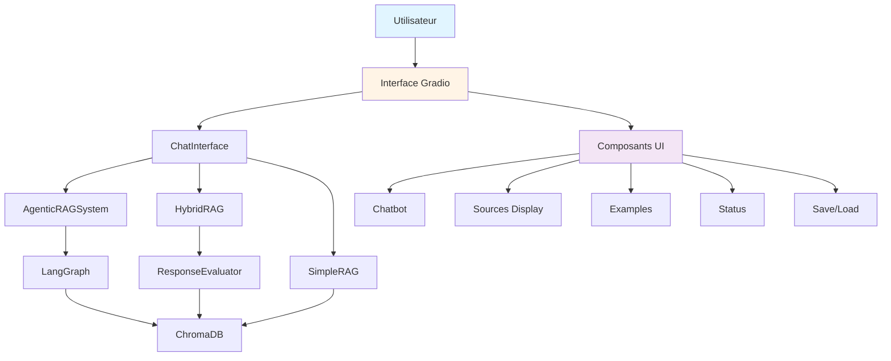

# Plan de Vérification et Amélioration - Gradio 6.8.0

**Date**: 2026-03-02  
**Version Gradio cible**: 6.8.0  
**Version actuelle**: >=6.6.0  
**Emplacement**: `agentic_rag/app/`

---

## Résumé Exécutif

Ce plan détaille la vérification et l'amélioration de l'application Gradio pour le système RAG agentic HAProxy 3.2. L'application actuelle utilise Gradio 6.6.0+ mais contient des problèmes de compatibilité avec Gradio 6.x et manque de fonctionnalités avancées.

---

## 1. Analyse de l'Implémentation Actuelle

### 1.1 Structure de l'Application

```
agentic_rag/app/
├── __init__.py
├── gradio_app.py          # Point d'entrée principal
├── chat_interface.py      # Interface de chat Gradio
├── rag_system.py          # Système RAG agentic
├── hybrid_rag.py           # Système hybride (Simple RAG + Fallback)
├── simple_rag.py          # Système RAG simple
├── simple_agentic.py      # Système agentic simple
├── document_manager.py    # Gestionnaire de documents
└── evaluator.py           # Évaluateur de réponses
```

### 1.2 Problèmes Identifiés

#### ❌ **PROBLÈME CRITIQUE #1: Incompatibilité Gradio 6.x**

**Emplacement**: [`chat_interface.py`](agentic_rag/app/chat_interface.py:59-67)

```python
with gr.Blocks(
    title='HAProxy 3.2 Agentic RAG',
    theme=gr.themes.Soft(),
    css="""
        .chat-container { max-height: 600px; overflow-y: auto; }
        .message { padding: 10px; margin: 5px 0; border-radius: 8px; }
        .user-message { background-color: #e3f2fd; }
        .assistant-message { background-color: #f5f5f5; }
    """,
) as demo:
```

**Problème**: Dans Gradio 6.x, les paramètres `theme` et `css` ont été déplacés du constructeur `gr.Blocks()` vers la méthode `launch()`.

**Impact**: 
- Le code actuel fonctionne mais émet des warnings de dépréciation
- L'application peut cesser de fonctionner dans les futures versions de Gradio 6.x

---

#### ⚠️ **PROBLÈME #2: Streaming non visible dans l'UI**

**Emplacement**: [`chat_interface.py`](agentic_rag/app/chat_interface.py:16-42)

```python
def respond(
    self,
    message: str,
    history: list[dict[str, str]],
) -> tuple[str, list[dict[str, str]]]:
    # Construire la réponse avec streaming
    response = ''
    for chunk in self.rag_system.query(self.current_session_id, message):
        response += chunk
    
    # Mettre à jour l'historique
    history.append({'role': 'user', 'content': message})
    history.append({'role': 'assistant', 'content': response})
    
    return '', history
```

**Problème**: Le streaming côté serveur est implémenté, mais l'interface utilisateur n'affiche pas la réponse en temps réel. L'utilisateur doit attendre que la réponse complète soit générée avant de la voir.

**Impact**: 
- Mauvaise expérience utilisateur
- Pas de feedback visuel pendant la génération

---

#### ⚠️ **PROBLÈME #3: Pas d'affichage des sources**

**Emplacement**: [`chat_interface.py`](agentic_rag/app/chat_interface.py:83-86)

```python
chatbot = gr.Chatbot(
    label='Conversation',
    height=500,
)
```

**Problème**: Le système RAG récupère les sources mais ne les affiche pas dans l'interface utilisateur.

**Impact**: 
- L'utilisateur ne peut pas vérifier les sources des réponses
- Perte de confiance dans les réponses

---

#### ⚠️ **PROBLÈME #4: Pas d'exemples de questions**

**Problème**: L'application ne fournit pas d'exemples de questions sur HAProxy pour aider les utilisateurs à démarrer.

**Impact**: 
- Difficulté pour les nouveaux utilisateurs
- Moins d'engagement

---

#### ⚠️ **PROBLÈME #5: Pas de gestion d'erreurs explicite**

**Problème**: Les erreurs ne sont pas gérées de manière explicite dans l'interface utilisateur.

**Impact**: 
- Mauvaise expérience utilisateur en cas d'erreur
- Difficulté de débogage

---

#### ⚠️ **PROBLÈME #6: Pas d'indicateurs de progression**

**Problème**: Aucun indicateur visuel de progression pendant la génération des réponses.

**Impact**: 
- L'utilisateur ne sait pas si l'application travaille
- Impression de blocage

---

#### ⚠️ **PROBLÈME #7: Pas de possibilité de sauvegarder les conversations**

**Problème**: Les conversations ne peuvent pas être sauvegardées ou exportées.

**Impact**: 
- Perte de l'historique des conversations
- Difficulté de reprendre une conversation

---

## 2. Plan d'Amélioration

### 2.1 Priorité 1: Correction de la Compatibilité Gradio 6.x

**Fichier**: [`chat_interface.py`](agentic_rag/app/chat_interface.py:59-67)

#### Avant (Code actuel):
```python
with gr.Blocks(
    title='HAProxy 3.2 Agentic RAG',
    theme=gr.themes.Soft(),
    css="""
        .chat-container { max-height: 600px; overflow-y: auto; }
        .message { padding: 10px; margin: 5px 0; border-radius: 8px; }
        .user-message { background-color: #e3f2fd; }
        .assistant-message { background-color: #f5f5f5; }
    """,
) as demo:
```

#### Après (Code corrigé):
```python
with gr.Blocks(
    title='HAProxy 3.2 Agentic RAG',
) as demo:
    # ... composants ...
    
demo.launch(
    theme=gr.themes.Soft(),
    css="""
        .chat-container { max-height: 600px; overflow-y: auto; }
        .message { padding: 10px; margin: 5px 0; border-radius: 8px; }
        .user-message { background-color: #e3f2fd; }
        .assistant-message { background-color: #f5f5f5; }
    """,
)
```

---

### 2.2 Priorité 2: Amélioration du Streaming Visuel

**Fichier**: [`chat_interface.py`](agentic_rag/app/chat_interface.py:16-42)

#### Modification de la méthode `respond()`:

```python
def respond(
    self,
    message: str,
    history: list[dict[str, str]],
) -> tuple[str, list[dict[str, str]]]:
    """Répond à un message de l'utilisateur avec streaming."""
    if not message.strip():
        return '', history
    
    # Ajouter le message utilisateur à l'historique
    history.append({'role': 'user', 'content': message})
    
    # Construire la réponse avec streaming
    response = ''
    for chunk in self.rag_system.query(self.current_session_id, message):
        response += chunk
        # Mettre à jour l'historique avec la réponse partielle
        history[-1] = {'role': 'assistant', 'content': response}
        yield '', history
    
    # Réponse finale
    yield '', history
```

#### Modification des event listeners:

```python
msg.submit(
    fn=self.respond,
    inputs=[msg, chatbot],
    outputs=[msg, chatbot],
)

submit_btn.click(
    fn=self.respond,
    inputs=[msg, chatbot],
    outputs=[msg, chatbot],
)
```

---

### 2.3 Priorité 3: Affichage des Sources

**Fichier**: [`chat_interface.py`](agentic_rag/app/chat_interface.py)

#### Ajout d'un composant pour afficher les sources:

```python
with gr.Blocks() as demo:
    gr.Markdown("# 🤖 HAProxy 3.2 Agentic RAG")
    
    with gr.Row():
        with gr.Column(scale=3):
            chatbot = gr.Chatbot(
                label='Conversation',
                height=500,
            )
        with gr.Column(scale=1):
            sources_display = gr.Markdown(
                label='Sources',
                value='**Sources utilisées:**\n\nAucune source pour le moment.',
            )
    
    with gr.Row():
        msg = gr.Textbox(
            label='Votre question',
            placeholder='Posez une question sur HAProxy 3.2...',
            scale=4,
            submit_btn=True,
        )
        submit_btn = gr.Button('Envoyer', variant='primary', scale=1)
    
    with gr.Row():
        clear_btn = gr.Button('Nouvelle conversation', variant='secondary')
```

#### Modification de la méthode `respond()` pour inclure les sources:

```python
def respond(
    self,
    message: str,
    history: list[dict[str, str]],
) -> tuple[str, list[dict[str, str]], str]:
    """Répond à un message de l'utilisateur avec streaming et sources."""
    if not message.strip():
        return '', history, '**Sources utilisées:**\n\nAucune source pour le moment.'
    
    # Ajouter le message utilisateur à l'historique
    history.append({'role': 'user', 'content': message})
    
    # Construire la réponse avec streaming
    response = ''
    sources_text = '**Sources utilisées:**\n\n'
    
    for chunk in self.rag_system.query(self.current_session_id, message):
        response += chunk
        history[-1] = {'role': 'assistant', 'content': response}
        yield '', history, sources_text + 'Chargement...'
    
    # Récupérer les sources (à implémenter dans rag_system.py)
    # sources = self.rag_system.get_sources(self.current_session_id)
    # for i, source in enumerate(sources, 1):
    #     sources_text += f'{i}. [{source.get("title", "N/A")}]({source.get("url", "#")})\n'
    
    yield '', history, sources_text + '\n\n*Sources récupérées depuis la documentation HAProxy 3.2*'
```

---

### 2.4 Priorité 4: Ajout d'Exemples de Questions

**Fichier**: [`chat_interface.py`](agentic_rag/app/chat_interface.py)

#### Ajout du composant `gr.Examples`:

```python
examples = [
    "Comment configurer un backend HTTP dans HAProxy 3.2 ?",
    "Quelles sont les nouvelles fonctionnalités de HAProxy 3.2 ?",
    "Comment utiliser le stick-table pour la persistance ?",
    "Comment configurer le load balancing avec round-robin ?",
    "Qu'est-ce que le multiplexer dans HAProxy 3.2 ?",
]

with gr.Blocks() as demo:
    gr.Markdown("# 🤖 HAProxy 3.2 Agentic RAG")
    
    with gr.Row():
        with gr.Column(scale=3):
            chatbot = gr.Chatbot(
                label='Conversation',
                height=500,
            )
        with gr.Column(scale=1):
            sources_display = gr.Markdown(
                label='Sources',
                value='**Sources utilisées:**\n\nAucune source pour le moment.',
            )
    
    with gr.Row():
        msg = gr.Textbox(
            label='Votre question',
            placeholder='Posez une question sur HAProxy 3.2...',
            scale=4,
            submit_btn=True,
        )
        submit_btn = gr.Button('Envoyer', variant='primary', scale=1)
    
    with gr.Row():
        clear_btn = gr.Button('Nouvelle conversation', variant='secondary')
    
    # Ajouter les exemples
    gr.Examples(
        examples=examples,
        inputs=msg,
        label='Exemples de questions:',
    )
```

---

### 2.5 Priorité 5: Gestion d'Erreurs Explicite

**Fichier**: [`chat_interface.py`](agentic_rag/app/chat_interface.py)

#### Modification de la méthode `respond()` avec gestion d'erreurs:

```python
def respond(
    self,
    message: str,
    history: list[dict[str, str]],
) -> tuple[str, list[dict[str, str]]]:
    """Répond à un message de l'utilisateur avec gestion d'erreurs."""
    if not message.strip():
        return '', history
    
    try:
        # Ajouter le message utilisateur à l'historique
        history.append({'role': 'user', 'content': message})
        
        # Construire la réponse avec streaming
        response = ''
        for chunk in self.rag_system.query(self.current_session_id, message):
            response += chunk
            history[-1] = {'role': 'assistant', 'content': response}
            yield '', history
        
        yield '', history
    
    except Exception as e:
        error_message = f"**Erreur:** {str(e)}\n\nVeuillez réessayer ou reformuler votre question."
        history.append({'role': 'assistant', 'content': error_message})
        yield '', history
        gr.Error(f"Une erreur s'est produite: {str(e)}")
```

---

### 2.6 Priorité 6: Indicateurs de Progression

**Fichier**: [`chat_interface.py`](agentic_rag/app/chat_interface.py)

#### Ajout d'un composant de statut:

```python
with gr.Blocks() as demo:
    gr.Markdown("# 🤖 HAProxy 3.2 Agentic RAG")
    
    status_text = gr.Textbox(
        label='Statut',
        value='Prêt',
        interactive=False,
        visible=False,
    )
    
    with gr.Row():
        with gr.Column(scale=3):
            chatbot = gr.Chatbot(
                label='Conversation',
                height=500,
            )
        with gr.Column(scale=1):
            sources_display = gr.Markdown(
                label='Sources',
                value='**Sources utilisées:**\n\nAucune source pour le moment.',
            )
```

#### Modification de la méthode `respond()` pour mettre à jour le statut:

```python
def respond(
    self,
    message: str,
    history: list[dict[str, str]],
) -> tuple[str, list[dict[str, str]], str]:
    """Répond à un message de l'utilisateur avec statut."""
    if not message.strip():
        return '', history, 'Prêt'
    
    try:
        yield '', history, 'Génération de la réponse en cours...'
        
        # Ajouter le message utilisateur à l'historique
        history.append({'role': 'user', 'content': message})
        
        # Construire la réponse avec streaming
        response = ''
        for chunk in self.rag_system.query(self.current_session_id, message):
            response += chunk
            history[-1] = {'role': 'assistant', 'content': response}
            yield '', history, f'Génération en cours... ({len(response)} caractères)'
        
        yield '', history, 'Réponse terminée'
    
    except Exception as e:
        error_message = f"**Erreur:** {str(e)}\n\nVeuillez réessayer ou reformuler votre question."
        history.append({'role': 'assistant', 'content': error_message})
        yield '', history, f'Erreur: {str(e)}'
```

---

### 2.7 Priorité 7: Sauvegarde des Conversations

**Fichier**: [`chat_interface.py`](agentic_rag/app/chat_interface.py)

#### Ajout de boutons pour sauvegarder/charger:

```python
with gr.Row():
    clear_btn = gr.Button('Nouvelle conversation', variant='secondary')
    save_btn = gr.Button('💾 Sauvegarder', variant='secondary')
    load_btn = gr.UploadButton(
        label='📂 Charger',
        file_types=['.json'],
    )
```

#### Ajout de méthodes pour sauvegarder/charger:

```python
import json
from datetime import datetime

def save_chat(self, history: list[dict[str, str]]) -> str:
    """Sauvegarde la conversation dans un fichier JSON."""
    timestamp = datetime.now().strftime("%Y%m%d_%H%M%S")
    filename = f"chat_history_{timestamp}.json"
    
    with open(filename, 'w', encoding='utf-8') as f:
        json.dump(history, f, ensure_ascii=False, indent=2)
    
    return f"Conversation sauvegardée dans {filename}"

def load_chat(self, file_data) -> tuple[list[dict[str, str]], str]:
    """Charge une conversation depuis un fichier JSON."""
    try:
        history = json.loads(file_data)
        return history, "Conversation chargée avec succès"
    except Exception as e:
        return [], f"Erreur lors du chargement: {str(e)}"

# Event listeners
save_btn.click(
    fn=self.save_chat,
    inputs=[chatbot],
    outputs=[gr.Textbox(visible=False)],
)

load_btn.upload(
    fn=self.load_chat,
    inputs=[load_btn],
    outputs=[chatbot, gr.Textbox(visible=False)],
)
```

---

### 2.8 Priorité 8: Amélioration de l'Accessibilité

**Fichier**: [`chat_interface.py`](agentic_rag/app/chat_interface.py)

#### Améliorations:
1. Ajouter des labels clairs et descriptifs
2. Utiliser des contrastes de couleurs accessibles
3. Ajouter du support pour les raccourcis clavier
4. Améliorer la navigation au clavier

```python
with gr.Blocks() as demo:
    gr.Markdown(
        """
        # 🤖 HAProxy 3.2 Agentic RAG
        
        Assistant intelligent basé sur la documentation officielle HAProxy 3.2.
        
        **Fonctionnalités:**
        - Recherche agentic avec LangGraph
        - Validation de configuration HAProxy
        - Citation des sources
        - Conversation contextuelle
        - Sauvegarde des conversations
        
        **Raccourcis clavier:**
        - `Entrée` : Envoyer le message
        - `Maj + Entrée` : Nouvelle ligne
        - `Échap` : Annuler la saisie
        """
    )
```

---

## 3. Nouvelles Fonctionnalités de Gradio 6.8.0 à Explorer

### 3.1 Composant `gr.MultimodalTextbox`

Permet aux utilisateurs de joindre des fichiers (images, PDF, etc.) à leurs questions.

**Cas d'usage**: 
- Uploader une configuration HAProxy pour validation
- Partager des captures d'écran

```python
msg = gr.MultimodalTextbox(
    label='Votre question',
    placeholder='Posez une question sur HAProxy 3.2 ou joignez un fichier...',
    scale=4,
    submit_btn=True,
    file_types=['.txt', '.conf', '.cfg', '.pdf', '.png', '.jpg'],
)
```

---

### 3.2 Composant `gr.Sidebar`

Permet de créer une barre latérale pour les options et paramètres.

**Cas d'usage**: 
- Paramètres du système RAG
- Historique des conversations
- Statistiques d'utilisation

```python
with gr.Blocks() as demo:
    with gr.Sidebar(position="left"):
        gr.Markdown("# ⚙️ Paramètres")
        
        model_select = gr.Dropdown(
            choices=['qwen3:latest', 'llama3:latest', 'mistral:latest'],
            label='Modèle LLM',
            value='qwen3:latest',
        )
        
        temperature = gr.Slider(
            minimum=0.0,
            maximum=2.0,
            value=0.1,
            step=0.1,
            label='Température',
        )
        
        max_tokens = gr.Slider(
            minimum=100,
            maximum=4000,
            value=2000,
            step=100,
            label='Tokens max',
        )
```

---

### 3.3 Composant `gr.Walkthrough`

Permet de créer des guides étape par étape pour les nouveaux utilisateurs.

**Cas d'usage**: 
- Guide de démarrage rapide
- Tutoriel sur les fonctionnalités avancées

```python
with gr.Walkthrough() as walkthrough:
    with gr.Step(id="step1"):
        gr.Markdown("""
            ## Étape 1: Posez votre question
            
            Tapez votre question sur HAProxy 3.2 dans la zone de texte ci-dessous.
            
            Exemples:
            - "Comment configurer un backend HTTP ?"
            - "Quelles sont les nouvelles fonctionnalités ?"
        """)
    
    with gr.Step(id="step2"):
        gr.Markdown("""
            ## Étape 2: Consultez les sources
            
            Les sources utilisées pour générer la réponse sont affichées à droite.
            
            Vous pouvez cliquer sur les liens pour consulter la documentation originale.
        """)
    
    with gr.Step(id="step3"):
        gr.Markdown("""
            ## Étape 3: Sauvegardez votre conversation
            
            Utilisez le bouton "Sauvegarder" pour conserver votre conversation.
            
            Vous pourrez la recharger ultérieurement.
        """)
```

---

### 3.4 Validation avec `gr.validate`

Permet de valider les entrées avant traitement.

**Cas d'usage**: 
- Vérifier que la question n'est pas vide
- Vérifier la longueur de la question

```python
def validate_question(question: str) -> gr.validate:
    """Valide la question de l'utilisateur."""
    if not question.strip():
        return gr.validate(False, "La question ne peut pas être vide")
    
    if len(question) < 5:
        return gr.validate(False, "La question doit contenir au moins 5 caractères")
    
    if len(question) > 500:
        return gr.validate(False, "La question ne peut pas dépasser 500 caractères")
    
    return gr.validate(True, "")

msg.submit(
    fn=self.respond,
    inputs=[msg, chatbot],
    outputs=[msg, chatbot],
    validator=validate_question,
)
```

---

### 3.5 Composant `gr.DeepLinkButton`

Permet de créer des liens de partage pour l'état actuel de l'application.

**Cas d'usage**: 
- Partager une conversation spécifique
- Partager une configuration

```python
deep_link_btn = gr.DeepLinkButton(
    value="🔗 Partager cette conversation",
)
```

---

## 4. Architecture de l'Application Améliorée



---

## 5. Implémentation Recommandée

### 5.1 Ordre de Priorité

1. **Priorité 1** (Critique): Corriger la compatibilité Gradio 6.x
2. **Priorité 2** (Haute): Améliorer le streaming visuel
3. **Priorité 3** (Haute): Afficher les sources
4. **Priorité 4** (Moyenne): Ajouter des exemples
5. **Priorité 5** (Moyenne): Gérer les erreurs
6. **Priorité 6** (Basse): Ajouter des indicateurs de progression
7. **Priorité 7** (Basse): Sauvegarder les conversations
8. **Priorité 8** (Optionnelle): Améliorer l'accessibilité

### 5.2 Fichiers à Modifier

| Fichier | Modifications | Priorité |
|--------|--------------|-----------|
| `agentic_rag/app/chat_interface.py` | Correction compatibilité Gradio 6.x, streaming, sources, exemples, erreurs, progression, sauvegarde | 1-7 |
| `agentic_rag/app/rag_system.py` | Ajouter méthode `get_sources()` | 3 |
| `agentic_rag/config_agentic.py` | Ajouter configuration pour exemples | 4 |
| `agentic_rag/app/gradio_app.py` | Mettre à jour `launch()` avec nouveaux paramètres | 1 |

### 5.3 Tests Recommandés

1. **Test de compatibilité**: Vérifier que l'application fonctionne sans warnings avec Gradio 6.8.0
2. **Test de streaming**: Vérifier que les réponses s'affichent en temps réel
3. **Test des sources**: Vérifier que les sources s'affichent correctement
4. **Test des exemples**: Vérifier que les exemples fonctionnent
5. **Test d'erreurs**: Vérifier que les erreurs sont gérées correctement
6. **Test de sauvegarde**: Vérifier que les conversations peuvent être sauvegardées et chargées

---

## 6. Ressources

- [Documentation Gradio 6.x](https://www.gradio.app/docs)
- [Guide de migration Gradio 6](https://www.gradio.app/guides/gradio-6-migration-guide)
- [Documentation LangGraph](https://langchain-ai.github.io/langgraph/)
- [Documentation HAProxy 3.2](https://docs.haproxy.org/3.2/)

---

## 7. Notes de Version

### Version Actuelle
- Gradio: >=6.6.0
- Python: 3.13.9
- LangGraph: >=1.0.8

### Version Cible
- Gradio: 6.8.0
- Python: 3.13.9
- LangGraph: >=1.0.8

---

## 8. Checklist de Validation

- [ ] Code compatible avec Gradio 6.8.0 (pas de warnings)
- [ ] Streaming visuel fonctionnel
- [ ] Sources affichées correctement
- [ ] Exemples de questions disponibles
- [ ] Gestion d'erreurs implémentée
- [ ] Indicateurs de progression visibles
- [ ] Sauvegarde/chargement des conversations fonctionnel
- [ ] Accessibilité améliorée
- [ ] Tests passés avec succès
- [ ] Documentation mise à jour

---

**Document créé par**: Kilo Code (Architect Mode)  
**Date de création**: 2026-03-02  
**Dernière mise à jour**: 2026-03-02
