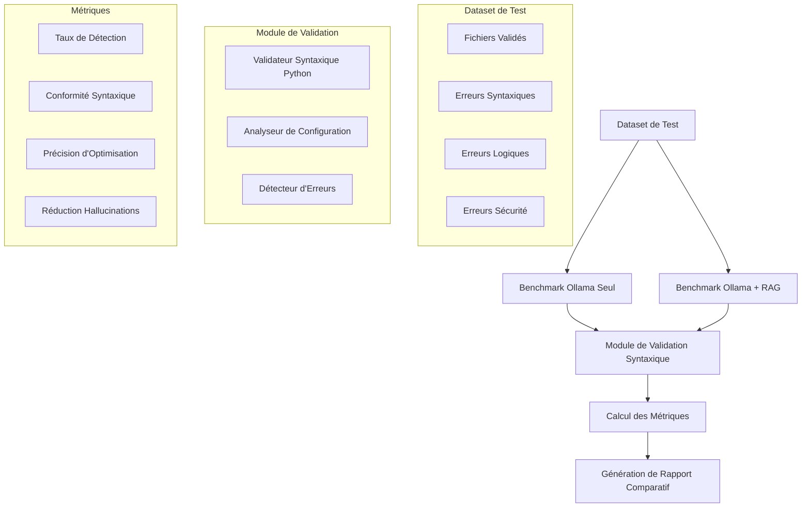
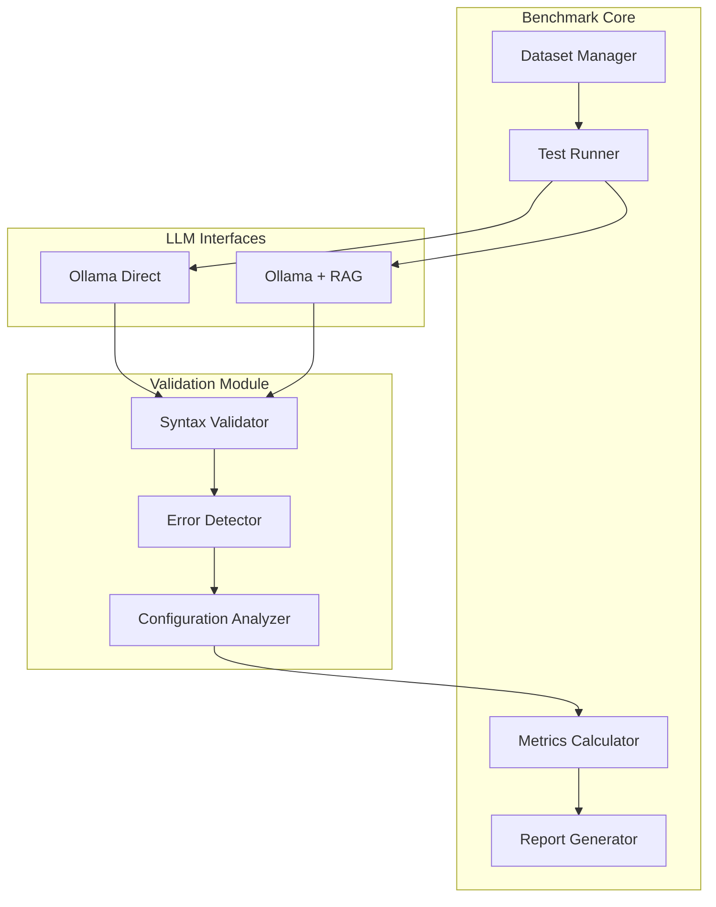

# Plan du Benchmark : Correction de Fichiers de Configuration HAProxy

## 1. Objectifs du Benchmark

Évaluer l'efficacité des prompts pour corriger et améliorer des fichiers de configuration HAProxy complets en comparant deux architectures :

1. **Ollama seul** (sans contexte externe)
2. **Ollama + RAG** (avec module de retrieval)

Le benchmark doit déterminer de manière factuelle si le système de retrieval apporte une valeur ajoutée mesurable.

## 2. Périmètre du Benchmark

### 2.1 Types de fichiers de configuration
- **Fichiers complets** : Configurations HAProxy complètes avec global, frontends, backends
- **Extraits ciblés** : Sections spécifiques (backend avec health check, frontend SSL, etc.)

### 2.2 Types d'erreurs à tester
- **Erreurs syntaxiques** : Mots-clés mal orthographiés, parenthèses manquantes, syntaxe invalide
- **Erreurs logiques** : Ports invalides, options incompatibles, références inexistantes
- **Erreurs de sécurité** : SSL mal configuré, vérifications manquantes, options dangereuses

### 2.3 Scénarios de test
1. **Correction d'erreurs** : Fichiers avec erreurs à corriger
2. **Amélioration de configuration** : Fichiers valides à optimiser
3. **Détection d'erreurs** : Identification des erreurs dans des fichiers

## 3. Architecture du Benchmark



## 4. Structure des Données

### 4.1 Format des cas de test
```python
{
    "id": "test_001",
    "name": "Backend avec health check HTTP mal configuré",
    "category": "syntax_error",
    "type": "correction",
    "config_type": "snippet",
    "original_config": "...",
    "expected_errors": [
        {
            "type": "syntax",
            "line": 5,
            "description": "option httpchk mal orthographiée",
            "severity": "error"
        }
    ],
    "expected_fixed_config": "...",
    "metadata": {
        "keywords": ["backend", "healthcheck", "httpchk"],
        "difficulty": "easy",
        "estimated_time": 30
    }
}
```

### 4.2 Catégories de difficulté
- **Easy** : Erreurs évidentes, corrections simples
- **Medium** : Erreurs nécessitant une compréhension approfondie
- **Hard** : Erreurs complexes, configurations avancées

## 5. Métriques de Performance

### 5.1 Taux de Détection d'Erreurs
```python
detection_rate = (errors_detected / total_errors) * 100
```

- **True Positive** : Erreur correctement identifiée
- **False Positive** : Erreur détectée mais inexistante
- **False Negative** : Erreur existante mais non détectée

### 5.2 Conformité Syntaxique
```python
syntax_compliance = (valid_configs / total_configs) * 100
```

- Validation syntaxique du fichier corrigé
- Respect de la grammaire HAProxy
- Absence d'erreurs de parsing

### 5.3 Précision de l'Optimisation
```python
optimization_precision = (correct_optimizations / total_optimizations) * 100
```

- Comparaison avec la configuration attendue
- Respect des bonnes pratiques HAProxy
- Maintien de la fonctionnalité originale

### 5.4 Réduction des Hallucinations
```python
hallucination_rate = (hallucinated_elements / total_elements) * 100
```

- Éléments inventés non présents dans la documentation
- Options inexistantes dans HAProxy
- Valeurs hors spécification

### 5.5 Métriques Additionnelles
- **Temps de réponse** : Latence de génération
- **Nombre de tokens** : Consommation de ressources
- **Taux de réussite global** : Combinaison de toutes les métriques

## 6. Module de Validation Syntaxique

### 6.1 Validateur Python Personnalisé
Composants :
- **Analyseur lexical** : Tokenisation de la configuration HAProxy
- **Analyseur syntaxique** : Validation de la grammaire HAProxy
- **Détecteur d'erreurs** : Identification des erreurs courantes
- **Validateur sémantique** : Vérification de la cohérence logique

### 6.2 Grammaire HAProxy simplifiée
```python
HAProxyGrammar = {
    "sections": ["global", "defaults", "frontend", "backend", "listen"],
    "directives": {
        "bind": ["address", "port", "options"],
        "server": ["name", "address", "port", "options"],
        "option": ["name", "parameters"],
        "acl": ["name", "criterion", "value"],
        # ...
    },
    "keywords": ["http", "tcp", "mode", "timeout", "balance", # ...]
}
```

## 7. Architecture du Benchmark

### 7.1 Composants principaux



### 7.2 Fichiers à créer

1. **`07_bench_config_correction.py`** : Script principal du benchmark
2. **`bench_config_dataset.py`** : Dataset de cas de test
3. **`haproxy_validator.py`** : Module de validation syntaxique
4. **`bench_config_metrics.py`** : Calcul des métriques
5. **`bench_config_report.py`** : Génération de rapports

## 8. Prompt Engineering

### 8.1 Prompt pour Ollama seul
```
Tu es un expert en configuration HAProxy.

Analyse le fichier de configuration suivant et :
1. Identifie toutes les erreurs (syntaxiques, logiques, de sécurité)
2. Propose les corrections nécessaires
3. Explique chaque correction

Configuration :
{config}

Réponds avec :
- Liste des erreurs trouvées
- Configuration corrigée
- Explications des corrections
```

### 8.2 Prompt pour Ollama + RAG
```
Tu es un expert en configuration HAProxy.

En utilisant UNIQUEMENT le contexte fourni ci-dessous :
1. Identifie toutes les erreurs dans la configuration
2. Propose les corrections nécessaires
3. Explique chaque correction avec des références à la documentation

<context>
{context}
</context>

Configuration à analyser :
{config}

RÈGLES ABSOLUES :
- Réponds UNIQUEMENT à partir du contexte fourni
- Cite TOUJOURS la source entre parenthèses
- JAMAIS d'invention ou de supposition
```

## 9. Dataset de Test

### 9.1 Cas de test proposés (20 cas)

#### Erreurs Syntaxiques (6 cas)
1. `syntax_001` : Mot-clé mal orthographié (optoin httpchk)
2. `syntax_002` : Parenthèses manquantes dans ACL
3. `syntax_003` : Guillemets manquants dans chemin de fichier
4. `syntax_004` : Syntaxe bind incorrecte
5. `syntax_005` : Option sans paramètres requis
6. `syntax_006` : Commentaire mal formé

#### Erreurs Logiques (6 cas)
7. `logic_001` : Port invalide (port > 65535)
8. `logic_002` : Backend référencé inexistant
9. `logic_003` : Option incompatible avec le mode
10. `logic_004` : Timeout négatif
11. `logic_005` : Serveur dupliqué
12. `logic_006` : Stick-table sans track-sc

#### Erreurs de Sécurité (4 cas)
13. `security_001` : SSL sans vérification de certificat
14. `security_002` : Stats sans authentification
15. `security_003` : ACL permissive (allow all)
16. `security_004` : Option forwardfor manquante

#### Améliorations (4 cas)
17. `optim_001` : Ajout de health check manquant
18. `optim_002` : Optimisation des timeouts
19. `optim_003` : Ajout de logs détaillés
20. `optim_004` : Configuration SSL améliorée

### 9.2 Fichiers de configuration complets (3 cas)
21. `full_001` : Configuration HTTP simple avec erreurs
22. `full_002` : Configuration TCP avancée
23. `full_003` : Configuration multi-backend complexe

## 10. Format des Rapports

### 10.1 Rapport JSON
```json
{
  "timestamp": "2026-02-26T22:00:00Z",
  "model": "gemma3:latest",
  "total_tests": 23,
  "results": {
    "ollama_only": {
      "detection_rate": 85.5,
      "syntax_compliance": 78.2,
      "optimization_precision": 72.3,
      "hallucination_rate": 15.4,
      "avg_time": 12.3
    },
    "ollama_rag": {
      "detection_rate": 92.7,
      "syntax_compliance": 88.5,
      "optimization_precision": 84.1,
      "hallucination_rate": 5.2,
      "avg_time": 18.7
    }
  },
  "comparison": {
    "detection_improvement": "+7.2%",
    "syntax_improvement": "+10.3%",
    "optimization_improvement": "+11.8%",
    "hallucination_reduction": "-10.2%"
  },
  "detailed_results": [...]
}
```

### 10.2 Rapport Markdown
- Résumé exécutif
- Tableau comparatif
- Analyse détaillée par catégorie
- Cas d'échec et recommandations
- Graphiques de performance

## 11. Implémentation

### 11.1 Étapes de développement

1. **Phase 1 : Infrastructure**
   - Création du module de validation syntaxique
   - Création du dataset de test
   - Définition des métriques

2. **Phase 2 : Benchmark Ollama seul**
   - Implémentation du runner de tests
   - Intégration avec Ollama
   - Collecte des résultats

3. **Phase 3 : Benchmark Ollama + RAG**
   - Intégration avec le retriever V3
   - Adaptation des prompts
   - Collecte des résultats

4. **Phase 4 : Analyse et Rapports**
   - Calcul des métriques
   - Génération de rapports
   - Visualisation des résultats

5. **Phase 5 : Tests et Documentation**
   - Tests d'intégration
   - Documentation utilisateur
   - Guide d'interprétation

### 11.2 Dépendances
```toml
[dependencies]
requests = "*"
numpy = "*"
matplotlib = "*"
```

## 12. Critères de Succès

Le benchmark sera considéré comme réussi si :

1. **Validité** : Le validateur syntaxique détecte correctement 90%+ des erreurs connues
2. **Reproductibilité** : Les résultats sont reproductibles sur plusieurs exécutions
3. **Comparabilité** : Les métriques permettent une comparaison claire entre Ollama seul et Ollama+RAG
4. **Actionnabilité** : Les rapports fournissent des insights exploitables

## 13. Questions Restantes

1. Quel modèle Ollama utiliser par défaut ? (gemma3:latest, qwen3:latest, autre)
2. Combien de cas de test inclure dans le dataset initial ?
3. Faut-il inclure des tests de performance (temps de réponse, consommation) ?
4. Comment gérer les cas où le modèle refuse de répondre (fallback) ?

## 14. Prochaines Étapes

1. Valider ce plan avec l'utilisateur
2. Créer le module de validation syntaxique
3. Construire le dataset de test initial
4. Implémenter le benchmark Ollama seul
5. Implémenter le benchmark Ollama + RAG
6. Exécuter les tests et analyser les résultats
