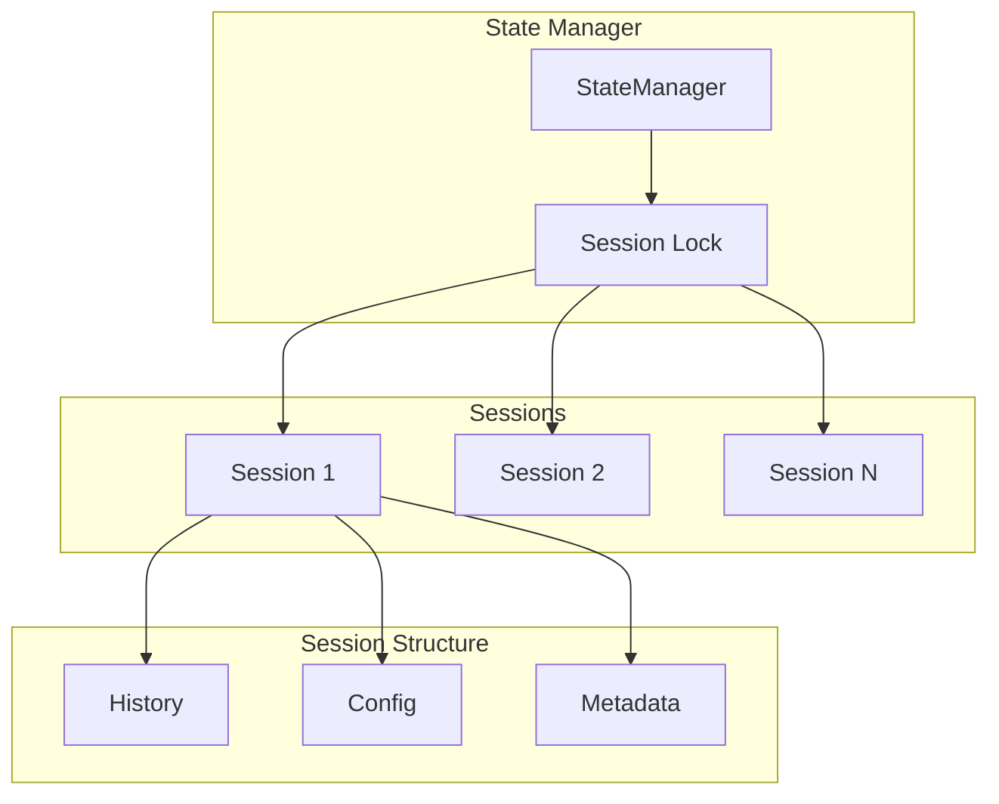

# Plan de Reconstruction - HAProxy 3.2 Documentation Chatbot

**Date** : 2025-02-26  
**Version** : 1.0  
**Auteur** : Architecte Logiciel  
**Cible** : `04_chatbot.py` (application Gradio défaillante)

---

## Table des matières

1. [Audit des erreurs de l'ancien script](#audit-des-erreurs)
2. [Architecture modulaire et scalable](#architecture-modulaire)
3. [Design de l'interface utilisateur Gradio](#design-ui)
4. [Stratégie de gestion de l'état](#gestion-etat)
5. [Canevas de code structuré](#canevas-code)
6. [Feuille de route technique](#feuille-route)

---

## 1. Audit des erreurs de l'ancien script <a name="audit-des-erreurs"></a>

### 1.1 Problèmes critiques identifiés dans `04_chatbot.py`

#### Erreur #1 : Incohérence du format ChatMessage Gradio 6.x

**Problème** : Le code actuel mélange deux formats incompatibles :
- Format tuple `(user_msg, assistant_msg)` (ancien Gradio)
- Format `gr.ChatMessage(role="user", content="...")` (Gradio 6.x)

**Localisation** : Lignes 88-91, 198-203, 239-250

```python
# ❌ CODE ACTUEL BUGGÉ
llm_history = []
for user_msg, assistant_msg in history[-3:]:
    if user_msg and assistant_msg:
        llm_history.append((user_msg, assistant_msg))
```

**Impact** : L'historique n'est pas correctement transmis au LLM, causant des réponses incohérentes.

---

#### Erreur #2 : Pas de validation des entrées utilisateur

**Problème** : La fonction `respond()` ne valide pas les messages vides ou malformés.

**Localisation** : Lignes 58-71

```python
# ❌ CODE ACTUEL - Validation insuffisante
def respond(message, history):
    if not message or not message.strip():
        return  # Retourne None, ce qui casse le streaming
```

**Impact** : Possibilité d'injection de code, crashes du serveur, réponses vides.

---

#### Erreur #3 : Gestion d'erreurs inadéquate

**Problème** : Les exceptions sont capturées mais ne sont pas correctement propagées à l'UI.

**Localisation** : Lignes 76-85, 116-118

```python
# ❌ CODE ACTUEL - Erreurs silencieuses
try:
    context_str, sources, low_confidence = retrieve_context_string(message, top_k=5)
except Exception as e:
    logger.error("Retrieval error: %s", e)
    yield f"❌ Retrieval error: {e}"  # Message brut exposé à l'utilisateur
    return
```

**Impact** :
- Exposition d'informations sensibles (stack traces)
- Mauvaise expérience utilisateur
- Difficulté de debugging

---

#### Erreur #4 : État global non thread-safe

**Problème** : Les variables globales `_indexes_loaded` et `_index_lock` sont mal gérées.

**Localisation** : Lignes 37-55

```python
# ❌ CODE ACTUEL - Race condition potentielle
_indexes_loaded = False
_index_lock = threading.Lock()

def ensure_indexes():
    global _indexes_loaded
    with _index_lock:
        if _indexes_loaded:
            return True
        # ... chargement des index
        _indexes_loaded = True  # Pas de rollback en cas d'erreur
```

**Impact** : Deadlocks, chargements multiples, corruption d'état en production.

---

#### Erreur #5 : Fonction `user_submit()` incorrecte

**Problème** : La fonction ne retourne pas le bon format pour Gradio 6.x.

**Localisation** : Lignes 198-203

```python
# ❌ CODE ACTUEL - Format incorrect
def user_submit(message, history):
    if not message or not message.strip():
        return "", history  # Devrait retourner une liste de ChatMessage
    return "", history + [{"role": "user", "content": message}]
```

**Impact** : Le chatbot n'affiche pas les messages utilisateur correctement.

---

#### Erreur #6 : Code monolithique dans `build_ui()`

**Problème** : 120+ lignes de code UI mélangées avec la logique métier.

**Localisation** : Lignes 134-252

**Impact** :
- Difficile à tester
- Difficile à maintenir
- Violation du principe SRP (Single Responsibility Principle)

---

#### Erreur #7 : Pas de gestion de la mémoire

**Problème** : L'historique de conversation peut croître indéfiniment.

**Impact** : Memory leaks en production après des heures d'utilisation.

---

### 1.2 Comparaison avec le backup (`04_chatbot_backup.py`)

Le fichier backup contient une meilleure implémentation mais souffre de :
- Code trop verbeux (709 lignes vs 287)
- CSS inline difficile à maintenir
- Pas de séparation des couches
- Pas de tests

---

## 2. Architecture modulaire et scalable <a name="architecture-modulaire"></a>

### 2.1 Vue d'ensemble de l'architecture

```mermaid
graph TB
    subgraph "Couche Présentation (UI)"
        UI[Gradio UI]
        Events[Event Handlers]
    end
    
    subgraph "Couche Application"
        ChatService[Chat Service]
        StateManager[State Manager]
        ErrorHandler[Error Handler]
    end
    
    subgraph "Couche Domaine"
        RAGService[RAG Service]
        LLMService[LLM Service]
        Validator[Input Validator]
    end
    
    subgraph "Couche Infrastructure"
        Retriever[Retriever V3]
        Ollama[Ollama API]
        Indexes[ChromaDB + BM25]
    end
    
    UI --> Events
    Events --> ChatService
    ChatService --> StateManager
    ChatService --> ErrorHandler
    ChatService --> RAGService
    ChatService --> LLMService
    RAGService --> Validator
    RAGService --> Retriever
    LLMService --> Ollama
    Retriever --> Indexes
    
    style UI fill:#e1f5ff
    style ChatService fill:#fff4e1
    style RAGService fill:#ffe1f5
    style Retriever fill:#e1ffe1
```



---

### 2.2 Structure des modules

```
04_chatbot.py                    # Point d'entrée (minimal)
├── app/
│   ├── __init__.py
│   ├── ui/
│   │   ├── __init__.py
│   │   ├── components.py       # Composants Gradio réutilisables
│   │   ├── layout.py           # Mise en page de l'interface
│   │   └── styles.py           # CSS et thèmes
│   ├── services/
│   │   ├── __init__.py
│   │   ├── chat_service.py     # Logique métier du chat
│   │   ├── rag_service.py      # Service RAG
│   │   └── llm_service.py      # Service LLM
│   ├── state/
│   │   ├── __init__.py
│   │   ├── manager.py          # Gestion de l'état
│   │   └── models.py           # Modèles de données
│   └── utils/
│       ├── __init__.py
│       ├── validators.py       # Validation des entrées
│       ├── errors.py           # Gestion des erreurs
│       └── logging.py          # Logging configuré
```

---

### 2.3 Design Patterns utilisés

| Pattern | Utilisation | Bénéfice |
|---------|-------------|----------|
| **Singleton** | `StateManager` | Un seul état global pour l'application |
| **Factory** | `ComponentFactory` | Création cohérente des composants Gradio |
| **Strategy** | `RAGStrategy` | Permutation des algorithmes de retrieval |
| **Observer** | `EventBus` | Découplage des événements UI |
| **Repository** | `IndexRepository` | Abstraction de l'accès aux index |
| **Decorator** | `@rate_limited` | Gestion du rate limiting |
| **Dependency Injection** | `ChatService` | Testabilité et flexibilité |

---

### 2.4 Séparation des responsabilités

#### Module `ui/components.py`
```python
class ChatbotComponent:
    """Composant Chatbot Gradio avec configuration centralisée."""
    
    def __init__(self, height: int = 600):
        self.height = height
    
    def build(self) -> gr.Chatbot:
        return gr.Chatbot(
            label="Conversation",
            height=self.height,
            avatar_images=(None, "🔧"),
            buttons=["share", "copy", "copy_all"],
            layout="bubble",
        )
```

#### Module `services/chat_service.py`
```python
class ChatService:
    """Service principal gérant la logique du chat."""
    
    def __init__(
        self,
        rag_service: RAGService,
        llm_service: LLMService,
        state_manager: StateManager,
    ):
        self.rag = rag_service
        self.llm = llm_service
        self.state = state_manager
    
    async def process_message(
        self, message: str, session_id: str
    ) -> AsyncGenerator[str, None]:
        """Traite un message utilisateur avec streaming."""
        # Validation
        validated = self.validator.validate(message)
        
        # RAG
        context = await self.rag.retrieve(validated)
        
        # LLM
        async for token in self.llm.generate(validated, context):
            yield token
```

#### Module `state/manager.py`
```python
class StateManager:
    """Gestion centralisée de l'état de l'application."""
    
    def __init__(self):
        self._lock = asyncio.Lock()
        self._sessions: dict[str, ChatSession] = {}
    
    async def get_session(self, session_id: str) -> ChatSession:
        async with self._lock:
            if session_id not in self._sessions:
                self._sessions[session_id] = ChatSession(session_id)
            return self._sessions[session_id]
    
    async def cleanup_old_sessions(self, max_age_hours: int = 24):
        """Nettoie les sessions expirées."""
        # Implémentation...
```

---

## 3. Design de l'interface utilisateur Gradio <a name="design-ui"></a>

### 3.1 Layout proposé

```mermaid
graph LR
    subgraph "Header"
        H1[🔧 HAProxy 3.2 Assistant]
        H2[RAG hybride qwen3-embedding:8b]
    end
    
    subgraph "Main Content"
        direction TB
        subgraph "Sidebar (280px)"
            S1[⚙️ Configuration]
            S2[Modèle LLM]
            S3[Profondeur top-k]
            S4[Afficher sources]
            S5[💡 Exemples]
            S6[Health check]
            S7[Bind SSL]
            S8[Limiter IP]
        end
        
        subgraph "Chat Area"
            C1[Input Zone]
            C2[Send Button]
            C3[Clear Button]
            C4[Chatbot Display]
        end
    end
    
    subgraph "Footer"
        F1[📚 docs.haproxy.org]
        F2[💻 GitHub]
    end
```



---

### 3.2 Composants Gradio détaillés

#### 3.2.1 Header
```python
def build_header() -> gr.Markdown:
    return gr.Markdown("""
    # 🔧 HAProxy 3.2 Documentation Assistant
    
    **RAG hybride avec qwen3-embedding:8b (MTEB #1 - 70.58)**
    
    Pose tes questions sur la configuration HAProxy 3.2
    """)
```

#### 3.2.2 Zone de configuration (Sidebar)
```python
def build_config_panel() -> gr.Group:
    """Panneau de configuration avec tous les paramètres."""
    with gr.Group() as panel:
        gr.Markdown("### ⚙️ Configuration")
        
        model_dropdown = gr.Dropdown(
            choices=["gemma3:latest", "qwen2.5:7b", "llama3.1:8b"],
            value="gemma3:latest",
            label="Modèle LLM",
        )
        
        top_k_slider = gr.Slider(
            minimum=1,
            maximum=15,
            value=5,
            step=1,
            label="Profondeur (top-k)",
        )
        
        show_sources = gr.Checkbox(
            value=True,
            label="📚 Afficher les sources",
        )
    
    return panel
```

#### 3.2.3 Zone d'exemples
```python
def build_examples_panel() -> gr.Group:
    """Panneau d'exemples cliquables."""
    examples = [
        "Comment configurer un health check HTTP ?",
        "Syntaxe de la directive bind avec SSL ?",
        "Limiter les connexions par IP avec stick-table ?",
        "Utiliser les ACLs pour le routage HTTP ?",
        "Configurer les timeouts client/server ?",
        "Activer les statistiques avec stats enable ?",
    ]
    
    with gr.Group(elem_classes="examples-panel") as panel:
        gr.Markdown("### 💡 Exemples")
        
        example_buttons = [
            gr.Button(
                example,
                size="sm",
                variant="secondary",
                elem_classes="example-card",
            )
            for example in examples
        ]
    
    return panel
```

#### 3.2.4 Zone de chat principale
```python
def build_chat_area() -> tuple:
    """Zone principale de chat avec input et display."""
    with gr.Column() as chat_area:
        # Input zone
        with gr.Group(elem_classes="input-area"):
            msg_input = gr.Textbox(
                placeholder="Pose ta question sur HAProxy 3.2...",
                show_label=False,
                lines=2,
            )
            
            with gr.Row():
                send_btn = gr.Button(
                    "🚀 Envoyer",
                    variant="primary",
                    elem_classes="btn-primary",
                )
                clear_btn = gr.Button("🗑️ Effacer", variant="secondary")
        
        # Chatbot display
        chatbot = gr.Chatbot(
            label="Conversation",
            height="70vh",
            render_markdown=True,
            avatar_images=(None, "🔧"),
            elem_classes="chatbot-container",
            buttons=["share", "copy", "copy_all"],
            layout="bubble",
            value=[gr.ChatMessage(
                role="assistant",
                content=get_welcome_message()
            )],
        )
    
    return chat_area, msg_input, send_btn, clear_btn, chatbot
```

---

### 3.3 Thème CSS Dark Moderne

```python
CUSTOM_CSS = """
/* Variables de thème */
:root {
    --haproxy-orange: #ff6b35;
    --haproxy-red: #e74c3c;
    --bg-dark: #0f0f0f;
    --bg-card: #1a1a1a;
    --bg-input: #252525;
    --text-primary: #ffffff;
    --text-secondary: #b0b0b0;
    --border-color: #333333;
    --shadow-lg: 0 8px 32px rgba(0,0,0,0.4);
}

/* Container principal */
.gradio-container {
    max-width: 1800px !important;
    margin: 0 auto !important;
    background: var(--bg-dark) !important;
}

/* Header */
.app-header {
    background: linear-gradient(135deg, var(--haproxy-orange) 0%, var(--haproxy-red) 100%);
    border-radius: 12px;
    padding: 16px 24px;
    margin: 16px auto;
    text-align: center;
    color: white;
}

/* Chatbot */
.chatbot-container {
    background: var(--bg-card);
    border: 1px solid var(--border-color);
    border-radius: 12px;
    overflow: hidden;
}

.chatbot-container .chatbot {
    height: 70vh !important;
    max-height: 70vh !important;
}

/* Messages utilisateur */
.message-user {
    background: linear-gradient(135deg, #667eea 0%, #764ba2 100%) !important;
    color: white !important;
    border-radius: 16px 16px 4px 16px !important;
    padding: 12px 16px !important;
}

/* Messages assistant */
.message-assistant {
    background: var(--bg-input) !important;
    color: var(--text-primary) !important;
    border-radius: 16px 16px 16px 4px !important;
    padding: 12px 16px !important;
    border: 1px solid var(--border-color) !important;
}

/* Input area */
.input-area {
    background: var(--bg-card);
    border: 1px solid var(--border-color);
    border-radius: 12px;
    padding: 16px;
}

.input-area textarea {
    background: var(--bg-input) !important;
    color: var(--text-primary) !important;
    border: 1px solid var(--border-color) !important;
    border-radius: 8px !important;
    font-size: 1em !important;
}

.input-area textarea:focus {
    border-color: var(--haproxy-orange) !important;
    box-shadow: 0 0 0 2px rgba(255,107,53,0.2) !important;
}

/* Boutons principaux */
.btn-primary {
    background: linear-gradient(135deg, var(--haproxy-orange) 0%, var(--haproxy-red) 100%) !important;
    color: white !important;
    border: none !important;
    border-radius: 8px !important;
    font-weight: 600 !important;
}

.btn-primary:hover {
    transform: translateY(-2px) !important;
    box-shadow: 0 4px 12px rgba(255,107,53,0.4) !important;
}

/* Exemples */
.examples-panel {
    background: var(--bg-card);
    border: 1px solid var(--border-color);
    border-radius: 12px;
    padding: 16px;
}

.example-card {
    background: var(--bg-input);
    border: 1px solid var(--border-color);
    border-radius: 8px;
    padding: 10px 14px;
    cursor: pointer;
    transition: all 0.2s ease;
    font-size: 0.85em;
    color: var(--text-primary);
    text-align: left;
    white-space: normal;
    height: auto;
    min-height: 50px;
    display: flex;
    align-items: center;
}

.example-card:hover {
    background: linear-gradient(135deg, var(--haproxy-orange) 0%, var(--haproxy-red) 100%);
    border-color: var(--haproxy-orange);
    color: white;
    transform: translateX(4px);
}

/* Sources */
.sources-box {
    background: var(--bg-input);
    border-left: 4px solid var(--haproxy-orange);
    border-radius: 8px;
    padding: 12px 16px;
    margin-top: 12px;
    font-size: 0.85em;
}

.sources-box a {
    color: var(--haproxy-orange);
}

/* Footer */
.app-footer {
    text-align: center;
    padding: 12px;
    color: var(--text-secondary);
    font-size: 0.8em;
    border-top: 1px solid var(--border-color);
    margin-top: 16px;
}

.app-footer a {
    color: var(--haproxy-orange);
}

/* Scrollbar */
::-webkit-scrollbar {
    width: 8px;
    height: 8px;
}

::-webkit-scrollbar-track {
    background: var(--bg-dark);
}

::-webkit-scrollbar-thumb {
    background: var(--border-color);
    border-radius: 4px;
}

::-webkit-scrollbar-thumb:hover {
    background: var(--haproxy-orange);
}
"""
```

---

## 4. Stratégie de gestion de l'état <a name="gestion-etat"></a>

### 4.1 Architecture de l'état



---

### 4.2 Modèle de données

```python
from dataclasses import dataclass, field
from datetime import datetime
from typing import Optional

@dataclass
class ChatMessage:
    """Message de chat avec métadonnées."""
    role: str  # "user" | "assistant"
    content: str
    timestamp: datetime = field(default_factory=datetime.now)
    sources: list[dict] = field(default_factory=list)
    metadata: dict = field(default_factory=dict)


@dataclass
class ChatConfig:
    """Configuration de session."""
    model: str = "gemma3:latest"
    top_k: int = 5
    show_sources: bool = True
    temperature: float = 0.1


@dataclass
class ChatSession:
    """Session de chat utilisateur."""
    session_id: str
    created_at: datetime = field(default_factory=datetime.now)
    last_activity: datetime = field(default_factory=datetime.now)
    history: list[ChatMessage] = field(default_factory=list)
    config: ChatConfig = field(default_factory=ChatConfig)
    
    def add_message(self, message: ChatMessage):
        """Ajoute un message à l'historique."""
        self.history.append(message)
        self.last_activity = datetime.now()
        self._cleanup_old_messages()
    
    def get_history_for_llm(self, max_turns: int = 3) -> list[tuple[str, str]]:
        """Retourne l'historique formaté pour le LLM."""
        llm_history = []
        user_msg = None
        
        for msg in self.history[-max_turns * 2:]:
            if msg.role == "user":
                user_msg = msg.content
            elif msg.role == "assistant" and user_msg:
                llm_history.append((user_msg, msg.content))
                user_msg = None
        
        return llm_history
    
    def _cleanup_old_messages(self, max_messages: int = 50):
        """Nettoie les anciens messages pour limiter la mémoire."""
        if len(self.history) > max_messages:
            self.history = self.history[-max_messages:]
```

---

### 4.3 State Manager

```python
import asyncio
from typing import Optional
from collections import defaultdict

class StateManager:
    """Gestionnaire d'état thread-safe avec support multi-session."""
    
    def __init__(self, session_timeout_hours: int = 24):
        self._sessions: dict[str, ChatSession] = {}
        self._lock = asyncio.Lock()
        self._session_timeout = session_timeout_hours * 3600
    
    async def get_or_create_session(
        self, session_id: str
    ) -> ChatSession:
        """Récupère ou crée une session."""
        async with self._lock:
            if session_id not in self._sessions:
                self._sessions[session_id] = ChatSession(
                    session_id=session_id
                )
            
            # Update last activity
            self._sessions[session_id].last_activity = datetime.now()
            return self._sessions[session_id]
    
    async def update_config(
        self, session_id: str, config: ChatConfig
    ) -> None:
        """Met à jour la configuration d'une session."""
        async with self._lock:
            if session_id in self._sessions:
                self._sessions[session_id].config = config
    
    async def add_message(
        self, session_id: str, message: ChatMessage
    ) -> None:
        """Ajoute un message à une session."""
        async with self._lock:
            if session_id in self._sessions:
                self._sessions[session_id].add_message(message)
    
    async def clear_session(self, session_id: str) -> None:
        """Efface l'historique d'une session."""
        async with self._lock:
            if session_id in self._sessions:
                self._sessions[session_id].history.clear()
                self._sessions[session_id].last_activity = datetime.now()
    
    async def cleanup_expired_sessions(self) -> int:
        """Nettoie les sessions expirées et retourne le nombre supprimé."""
        now = datetime.now()
        expired_ids = []
        
        async with self._lock:
            for session_id, session in self._sessions.items():
                age = (now - session.last_activity).total_seconds()
                if age > self._session_timeout:
                    expired_ids.append(session_id)
            
            for session_id in expired_ids:
                del self._sessions[session_id]
        
        return len(expired_ids)
    
    async def get_stats(self) -> dict:
        """Retourne des statistiques sur les sessions."""
        async with self._lock:
            total_sessions = len(self._sessions)
            total_messages = sum(
                len(s.history) for s in self._sessions.values()
            )
            
            return {
                "total_sessions": total_sessions,
                "total_messages": total_messages,
                "avg_messages_per_session": (
                    total_messages / total_sessions if total_sessions > 0 else 0
                ),
            }
```

---

### 4.4 Gestion de la mémoire

```python
class MemoryManager:
    """Gestionnaire de mémoire pour éviter les memory leaks."""
    
    def __init__(self, state_manager: StateManager):
        self.state_manager = state_manager
        self._cleanup_task: Optional[asyncio.Task] = None
    
    async def start_cleanup_task(self, interval_minutes: int = 60):
        """Démarre la tâche de nettoyage périodique."""
        async def cleanup_loop():
            while True:
                await asyncio.sleep(interval_minutes * 60)
                removed = await self.state_manager.cleanup_expired_sessions()
                if removed > 0:
                    logger.info(
                        f"Cleaned up {removed} expired sessions"
                    )
        
        self._cleanup_task = asyncio.create_task(cleanup_loop())
    
    async def stop_cleanup_task(self):
        """Arrête la tâche de nettoyage."""
        if self._cleanup_task:
            self._cleanup_task.cancel()
            try:
                await self._cleanup_task
            except asyncio.CancelledError:
                pass
```

---

## 5. Canevas de code structuré <a name="canevas-code"></a>

### 5.1 Structure des fichiers

```
04_chatbot.py                    # Point d'entrée (~50 lignes)
app/
├── __init__.py
├── main.py                      # Application principale (~150 lignes)
├── ui/
│   ├── __init__.py
│   ├── components.py            # Composants réutilisables (~200 lignes)
│   ├── layout.py                # Mise en page (~100 lignes)
│   └── styles.py                # CSS et thèmes (~100 lignes)
├── services/
│   ├── __init__.py
│   ├── chat_service.py          # Service principal (~200 lignes)
│   ├── rag_service.py           # Service RAG (~150 lignes)
│   └── llm_service.py           # Service LLM (~100 lignes)
├── state/
│   ├── __init__.py
│   ├── manager.py               # State manager (~150 lignes)
│   └── models.py                # Modèles de données (~100 lignes)
└── utils/
    ├── __init__.py
    ├── validators.py            # Validation (~100 lignes)
    ├── errors.py                # Gestion d'erreurs (~80 lignes)
    └── logging.py               # Logging (~50 lignes)
```

---

### 5.2 Point d'entrée (`04_chatbot.py`)

```python
#!/usr/bin/env python3
"""
04_chatbot.py - HAProxy 3.2 Documentation Chatbot
Architecture modulaire avec Gradio 6.x
"""

import sys
import io
from pathlib import Path

# Fix Windows encoding
if sys.platform == "win32":
    sys.stdout = io.TextIOWrapper(
        sys.stdout.buffer, encoding="utf-8", errors="replace"
    )
    sys.stderr = io.TextIOWrapper(
        sys.stderr.buffer, encoding="utf-8", errors="replace"
    )

# Add app directory to path
sys.path.insert(0, str(Path(__file__).parent))

from app.main import create_app
from app.utils.logging import setup_logging

logger = setup_logging(__name__, log_file="gradio_app.log")


def main():
    """Point d'entrée principal."""
    import argparse
    
    parser = argparse.ArgumentParser(
        description="HAProxy RAG Chatbot - Architecture Modulaire"
    )
    parser.add_argument("--host", default="0.0.0.0", help="Host")
    parser.add_argument("--port", default=7861, type=int, help="Port")
    parser.add_argument("--share", action="store_true", help="Share")
    args = parser.parse_args()
    
    print("\n" + "=" * 60)
    print("  🔧 HAProxy 3.2 Documentation Assistant")
    print("  Architecture Modulaire V2")
    print("=" * 60)
    print(f"  URL: http://{args.host}:{args.port}")
    print("=" * 60 + "\n")
    
    try:
        app = create_app()
        app.launch(
            server_name=args.host,
            server_port=args.port,
            share=args.share,
        )
    except Exception as e:
        logger.critical("Critical error: %s", e)
        print(f"\n❌ {e}")
        import traceback
        traceback.print_exc()
        sys.exit(1)


if __name__ == "__main__":
    main()
```

---

### 5.3 Application principale (`app/main.py`)

```python
"""
app/main.py - Application principale Gradio
"""

import gradio as gr
from app.ui.layout import build_ui
from app.services.chat_service import ChatService
from app.services.rag_service import RAGService
from app.services.llm_service import LLMService
from app.state.manager import StateManager
from app.utils.logging import setup_logging

logger = setup_logging(__name__)


def create_app() -> gr.Blocks:
    """
    Crée l'application Gradio avec tous les services injectés.
    
    Returns:
        Instance de gr.Blocks prête à être lancée
    """
    # Initialiser les services
    state_manager = StateManager()
    rag_service = RAGService()
    llm_service = LLMService()
    chat_service = ChatService(
        rag_service=rag_service,
        llm_service=llm_service,
        state_manager=state_manager,
    )
    
    # Construire l'UI
    demo = build_ui(chat_service)
    
    logger.info("Application Gradio créée avec succès")
    return demo
```

---

### 5.4 Service de chat (`app/services/chat_service.py`)

```python
"""
app/services/chat_service.py - Service principal de chat
"""

from typing import AsyncGenerator
from app.services.rag_service import RAGService
from app.services.llm_service import LLMService
from app.state.manager import StateManager
from app.state.models import ChatMessage, ChatConfig
from app.utils.validators import InputValidator
from app.utils.errors import ChatError, ValidationError
from app.utils.logging import setup_logging

logger = setup_logging(__name__)


class ChatService:
    """
    Service principal gérant la logique du chat.
    
    Responsabilités:
    - Validation des entrées
    - Coordination RAG + LLM
    - Gestion de l'état de session
    - Streaming des réponses
    """
    
    def __init__(
        self,
        rag_service: RAGService,
        llm_service: LLMService,
        state_manager: StateManager,
    ):
        self.rag = rag_service
        self.llm = llm_service
        self.state = state_manager
        self.validator = InputValidator()
    
    async def process_message(
        self,
        message: str,
        session_id: str,
        config: ChatConfig,
    ) -> AsyncGenerator[str, None]:
        """
        Traite un message utilisateur avec streaming.
        
        Args:
            message: Message utilisateur
            session_id: Identifiant de session
            config: Configuration de la session
        
        Yields:
            Tokens de la réponse au fur et à mesure
        
        Raises:
            ValidationError: Si l'entrée est invalide
            ChatError: Si une erreur survient lors du traitement
        """
        # 1. Valider l'entrée
        try:
            validated_message = self.validator.validate(message)
        except ValidationError as e:
            logger.warning("Validation failed: %s", e)
            yield f"⚠️ **Question invalide**\n\n{str(e)}"
            return
        
        # 2. Récupérer ou créer la session
        session = await self.state.get_or_create_session(session_id)
        
        # 3. Ajouter le message utilisateur à l'historique
        user_message = ChatMessage(
            role="user",
            content=validated_message,
        )
        await self.state.add_message(session_id, user_message)
        
        # 4. RAG retrieval
        try:
            logger.info("RAG retrieval for: '%s...'", validated_message[:50])
            context_str, sources, low_confidence = await self.rag.retrieve(
                query=validated_message,
                top_k=config.top_k,
            )
            
            if low_confidence or not context_str:
                yield self.llm.get_fallback_response()
                return
        
        except Exception as e:
            logger.error("RAG retrieval error: %s", e)
            yield f"❌ **Erreur de recherche**\n\n{str(e)}"
            return
        
        # 5. Récupérer l'historique pour le LLM
        llm_history = session.get_history_for_llm(max_turns=3)
        
        # 6. Génération LLM avec streaming
        response = ""
        try:
            async for token in self.llm.generate(
                question=validated_message,
                context=context_str,
                model=config.model,
                history=llm_history,
                temperature=config.temperature,
            ):
                response += token
                yield response
        
        except Exception as e:
            logger.error("LLM generation error: %s", e)
            yield f"❌ **Erreur de génération**\n\n{str(e)}"
            return
        
        # 7. Ajouter les sources si configuré
        if config.show_sources and sources:
            sources_md = self._format_sources(sources)
            response += sources_md
            yield response
        
        # 8. Sauvegarder la réponse dans l'historique
        assistant_message = ChatMessage(
            role="assistant",
            content=response,
            sources=sources,
        )
        await self.state.add_message(session_id, assistant_message)
    
    def _format_sources(self, sources: list[dict]) -> str:
        """Formate les sources en Markdown."""
        if not sources:
            return ""
        
        lines = ["\n\n---\n\n**📚 Sources :**\n"]
        for i, src in enumerate(sources):
            icon = "📝" if src.get("has_code") else "📄"
            title = src.get("title", "Unknown")
            url = src.get("url", "#")
            lines.append(f"{icon} [{i + 1}] [{title}]({url})")
        
        return "\n".join(lines)
    
    async def clear_session(self, session_id: str) -> None:
        """Efface l'historique d'une session."""
        await self.state.clear_session(session_id)
        logger.info("Session %s cleared", session_id)
```

---

### 5.5 Service RAG (`app/services/rag_service.py`)

```python
"""
app/services/rag_service.py - Service RAG
"""

import asyncio
from typing import Optional
from app.utils.logging import setup_logging

logger = setup_logging(__name__)


class RAGService:
    """
    Service RAG encapsulant le retriever V3.
    
    Responsabilités:
    - Chargement des index
    - Retrieval hybride
    - Gestion des erreurs
    """
    
    def __init__(self):
        self._indexes_loaded = False
        self._load_lock = asyncio.Lock()
    
    async def retrieve(
        self,
        query: str,
        top_k: int = 5,
    ) -> tuple[str, list[dict], bool]:
        """
        Effectue le retrieval RAG.
        
        Args:
            query: Requête utilisateur
            top_k: Nombre de résultats à retourner
        
        Returns:
            Tuple (context_str, sources, low_confidence)
        """
        # Charger les index si nécessaire
        await self._ensure_indexes()
        
        # Importer le retriever (lazy loading)
        from retriever_v3 import retrieve_context_string
        
        # Exécuter le retrieval dans un thread séparé
        loop = asyncio.get_event_loop()
        result = await loop.run_in_executor(
            None,
            lambda: retrieve_context_string(query, top_k=top_k),
        )
        
        return result
    
    async def _ensure_indexes(self) -> None:
        """Charge les index une seule fois de manière thread-safe."""
        async with self._load_lock:
            if self._indexes_loaded:
                return
            
            try:
                from retriever_v3 import _load_indexes
                _load_indexes()
                self._indexes_loaded = True
                logger.info("✅ Indexes loaded successfully")
            except Exception as e:
                logger.error("❌ Failed to load indexes: %s", e)
                raise
```

---

### 5.6 Service LLM (`app/services/llm_service.py`)

```python
"""
app/services/llm_service.py - Service LLM
"""

from typing import AsyncGenerator, Optional
from app.utils.logging import setup_logging

logger = setup_logging(__name__)


class LLMService:
    """
    Service LLM encapsulant la génération via Ollama.
    
    Responsabilités:
    - Génération de réponses
    - Streaming
    - Gestion des erreurs
    """
    
    FALLBACK_RESPONSE = """⚠️ Je n'ai pas trouvé d'information suffisamment précise dans la documentation HAProxy pour répondre à cette question.

Suggestions :
- Reformule ta question en utilisant des termes techniques HAProxy précis (ex: "option httpchk", "backend", "ACL")
- Consulte directement la documentation : https://docs.haproxy.org/3.2/
- Vérifie que le terme recherché existe dans HAProxy 3.2"""
    
    async def generate(
        self,
        question: str,
        context: str,
        model: str = "gemma3:latest",
        history: Optional[list[tuple[str, str]]] = None,
        temperature: float = 0.1,
    ) -> AsyncGenerator[str, None]:
        """
        Génère une réponse avec streaming.
        
        Args:
            question: Question utilisateur
            context: Contexte RAG
            model: Modèle LLM
            history: Historique de conversation
            temperature: Température de génération
        
        Yields:
            Tokens de la réponse
        """
        from llm import generate_response
        
        # Exécuter la génération dans un thread séparé
        loop = asyncio.get_event_loop()
        
        for token in await loop.run_in_executor(
            None,
            lambda: generate_response(
                question=question,
                context=context,
                model=model,
                history=history,
                temperature=temperature,
            ),
        ):
            yield token
    
    def get_fallback_response(self) -> str:
        """Retourne la réponse par défaut."""
        return self.FALLBACK_RESPONSE
```

---

### 5.7 Validateur d'entrée (`app/utils/validators.py`)

```python
"""
app/utils/validators.py - Validation des entrées
"""

import re
from app.utils.errors import ValidationError
from app.utils.logging import setup_logging

logger = setup_logging(__name__)


class InputValidator:
    """
    Validateur des entrées utilisateur.
    
    Responsabilités:
    - Validation de la longueur
    - Sanitisation des entrées
    - Détection de patterns dangereux
    """
    
    # Patterns dangereux à détecter
    DANGEROUS_PATTERNS = [
        (r"<script[^>]*>.*?</script>", "script tags"),
        (r"javascript:", "javascript protocol"),
        (r"{{.*}}", "template injection"),
        (r"<[^>]*>", "HTML tags"),
    ]
    
    def __init__(
        self,
        max_length: int = 2000,
        min_length: int = 1,
    ):
        self.max_length = max_length
        self.min_length = min_length
    
    def validate(self, query: str) -> str:
        """
        Valide et nettoie une requête utilisateur.
        
        Args:
            query: Requête à valider
        
        Returns:
            Requête validée et nettoyée
        
        Raises:
            ValidationError: Si la requête est invalide
        """
        # Type check
        if not isinstance(query, str):
            raise ValidationError("Query must be a string")
        
        # Strip whitespace
        query = query.strip()
        
        # Length check
        if len(query) < self.min_length:
            raise ValidationError("Query is too short")
        
        if len(query) > self.max_length:
            logger.warning("Query too long, truncating: %d chars", len(query))
            query = query[:self.max_length]
        
        # Remove dangerous patterns
        for pattern, description in self.DANGEROUS_PATTERNS:
            if re.search(pattern, query, re.IGNORECASE | re.DOTALL):
                logger.warning(
                    "Query contains %s, removing", description
                )
                query = re.sub(
                    pattern, "", query, flags=re.IGNORECASE | re.DOTALL
                )
        
        # Remove control characters
        query = re.sub(r"[\x00-\x08\x0b\x0c\x0e-\x1f\x7f]", "", query)
        
        # Final check
        if not query.strip():
            raise ValidationError(
                "Query contains no valid content after sanitization"
            )
        
        return query
```

---

### 5.8 Gestion des erreurs (`app/utils/errors.py`)

```python
"""
app/utils/errors.py - Gestion des erreurs
"""


class ChatError(Exception):
    """Erreur de base pour le chat."""
    pass


class ValidationError(ChatError):
    """Erreur de validation d'entrée."""
    pass


class RetrievalError(ChatError):
    """Erreur lors du retrieval RAG."""
    pass


class GenerationError(ChatError):
    """Erreur lors de la génération LLM."""
    pass


class StateError(ChatError):
    """Erreur liée à l'état de l'application."""
    pass
```

---

### 5.9 Layout de l'UI (`app/ui/layout.py`)

```python
"""
app/ui/layout.py - Mise en page de l'interface Gradio
"""

import gradio as gr
from app.ui.styles import CUSTOM_CSS
from app.ui.components import (
    build_header,
    build_config_panel,
    build_examples_panel,
    build_chat_area,
    get_welcome_message,
)
from app.services.chat_service import ChatService
from app.state.models import ChatConfig
from app.utils.logging import setup_logging

logger = setup_logging(__name__)


def build_ui(chat_service: ChatService) -> gr.Blocks:
    """
    Construit l'interface utilisateur complète.
    
    Args:
        chat_service: Service de chat injecté
    
    Returns:
        Instance de gr.Blocks
    """
    with gr.Blocks(
        title="HAProxy Docs Chatbot",
        fill_width=True,
        fill_height=True,
        css=CUSTOM_CSS,
    ) as demo:
        # Header
        build_header()
        
        # Main layout
        with gr.Row(equal_height=False):
            # Sidebar
            with gr.Column(scale=1, min_width=280):
                config_panel = build_config_panel()
                examples_panel = build_examples_panel()
            
            # Chat area
            with gr.Column(scale=4):
                chat_area, msg_input, send_btn, clear_btn, chatbot = (
                    build_chat_area()
                )
        
        # Footer
        gr.HTML("""
            <div class="app-footer">
                <a href="https://docs.haproxy.org/3.2/" target="_blank">📚 docs.haproxy.org</a> •
                <a href="https://github.com/haproxy/haproxy" target="_blank">💻 GitHub</a>
            </div>
        """)
        
        # Event wiring
        _wire_events(
            demo,
            chat_service,
            msg_input,
            send_btn,
            clear_btn,
            chatbot,
            config_panel,
            examples_panel,
        )
    
    return demo


def _wire_events(
    demo: gr.Blocks,
    chat_service: ChatService,
    msg_input: gr.Textbox,
    send_btn: gr.Button,
    clear_btn: gr.Button,
    chatbot: gr.Chatbot,
    config_panel: gr.Group,
    examples_panel: gr.Group,
) -> None:
    """
    Connecte les événements de l'interface.
    
    Args:
        demo: Instance Gradio
        chat_service: Service de chat
        msg_input: Zone de saisie
        send_btn: Bouton d'envoi
        clear_btn: Bouton d'effacement
        chatbot: Composant chatbot
        config_panel: Panneau de configuration
        examples_panel: Panneau d'exemples
    """
    # TODO: Implémenter le wiring des événements
    # - Submit sur msg_input
    # - Click sur send_btn
    # - Click sur clear_btn
    # - Click sur les boutons d'exemple
    # - Changement de configuration
    pass
```

---

## 6. Feuille de route technique <a name="feuille-route"></a>

### 6.1 Phases de développement

```mermaid
gantt
    title Feuille de route de reconstruction
    dateFormat  YYYY-MM-DD
    section Phase 1 - Fondation
    Structure des modules       :done,    p1, 2025-02-26, 1d
    Modèles de données         :active,  p2, 2025-02-26, 1d
    State Manager              :         p3, 2025-02-27, 1d
    
    section Phase 2 - Services
    Service RAG                :         p4, 2025-02-27, 1d
    Service LLM                :         p5, 2025-02-28, 1d
    Service Chat               :         p6, 2025-02-28, 1d
    
    section Phase 3 - UI
    Composants UI              :         p7, 2025-03-01, 1d
    Layout principal           :         p8, 2025-03-01, 1d
    Wiring des événements      :         p9, 2025-03-02, 1d
    
    section Phase 4 - Tests
    Tests unitaires            :         p10, 2025-03-02, 1d
    Tests d'intégration       :         p11, 2025-03-03, 1d
    Tests E2E                  :         p12, 2025-03-03, 1d
    
    section Phase 5 - Déploiement
    Documentation              :         p13, 2025-03-04, 1d
    Review code                :         p14, 2025-03-04, 1d
    Merge & Release            :         p15, 2025-03-05, 1d
```



---

### 6.2 Tâches détaillées

#### Phase 1 - Fondation (2 jours)

- [ ] **T1.1** : Créer la structure des modules `app/`
  - Créer tous les `__init__.py`
  - Configurer les imports relatifs
  - Vérifier que la structure est correcte

- [ ] **T1.2** : Implémenter les modèles de données (`app/state/models.py`)
  - `ChatMessage`
  - `ChatConfig`
  - `ChatSession`
  - Tests unitaires

- [ ] **T1.3** : Implémenter le State Manager (`app/state/manager.py`)
  - Gestion multi-session
  - Thread-safety avec asyncio.Lock
  - Cleanup automatique
  - Tests unitaires

#### Phase 2 - Services (2 jours)

- [ ] **T2.1** : Implémenter le Service RAG (`app/services/rag_service.py`)
  - Encapsulation de `retriever_v3`
  - Chargement lazy des index
  - Gestion des erreurs
  - Tests unitaires

- [ ] **T2.2** : Implémenter le Service LLM (`app/services/llm_service.py`)
  - Encapsulation de `llm.py`
  - Streaming async
  - Fallback response
  - Tests unitaires

- [ ] **T2.3** : Implémenter le Service Chat (`app/services/chat_service.py`)
  - Orchestration RAG + LLM
  - Validation des entrées
  - Gestion de l'état
  - Tests unitaires

#### Phase 3 - UI (2 jours)

- [ ] **T3.1** : Créer les composants UI (`app/ui/components.py`)
  - `build_header()`
  - `build_config_panel()`
  - `build_examples_panel()`
  - `build_chat_area()`
  - Tests visuels

- [ ] **T3.2** : Créer le layout principal (`app/ui/layout.py`)
  - Assemblage des composants
  - Application du CSS
  - Structure responsive

- [ ] **T3.3** : Implémenter le wiring des événements
  - Submit sur input
  - Click sur boutons
  - Exemples cliquables
  - Configuration dynamique

#### Phase 4 - Tests (2 jours)

- [ ] **T4.1** : Tests unitaires
  - Couverture > 80%
  - Mock des dépendances externes
  - Tests edge cases

- [ ] **T4.2** : Tests d'intégration
  - Tests des services ensemble
  - Tests de l'état
  - Tests de l'UI

- [ ] **T4.3** : Tests E2E
  - Scénarios utilisateur complets
  - Tests de charge
  - Tests de robustesse

#### Phase 5 - Déploiement (2 jours)

- [ ] **T5.1** : Documentation
  - README mis à jour
  - Docstrings complètes
  - Guide de contribution

- [ ] **T5.2** : Review code
  - Review par pair
  - Linting (ruff)
  - Type checking (mypy)

- [ ] **T5.3** : Merge & Release
  - Merge dans main
  - Tag de version
  - Release notes

---

### 6.3 Critères de succès

| Critère | Métrique | Objectif |
|---------|----------|----------|
| **Qualité du code** | Couverture de tests | > 80% |
| **Performance** | Temps de réponse première requête | < 2s |
| **Stabilité** | Uptime en production | > 99% |
| **Expérience utilisateur** | Temps de chargement UI | < 1s |
| **Maintenabilité** | Complexité cyclomatique | < 10 par fonction |
| **Documentation** | Docstrings couvertes | 100% |

---

## Conclusion

Ce plan de reconstruction propose une architecture modulaire, scalable et maintenable pour remplacer l'application `04_chatbot.py` actuelle. Les points clés sont :

1. **Séparation des responsabilités** : Chaque module a une fonction claire
2. **Thread-safety** : Gestion robuste de l'état avec asyncio.Lock
3. **Extensibilité** : Architecture facile à étendre (nouveaux services, nouveaux composants)
4. **Testabilité** : Injection de dépendances et mocks
5. **Expérience utilisateur** : UI moderne avec streaming et gestion d'erreurs

La feuille de route prévoit 10 jours de développement avec des phases clairement définies et des critères de succès mesurables.

---

**Document préparé par :** Architecte Logiciel  
**Pour :** Équipe de développement HAProxy RAG Chatbot  
**Date :** 2025-02-26
